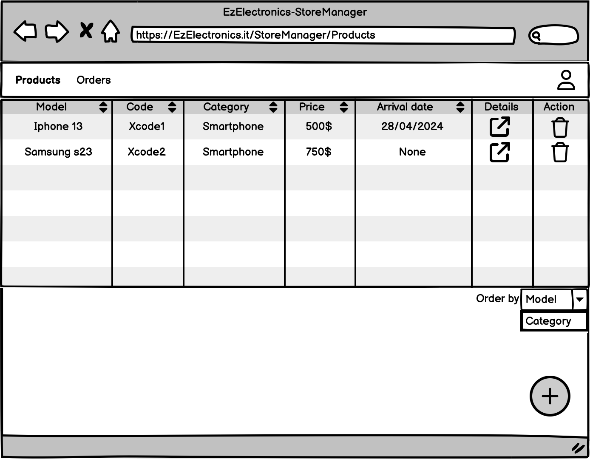
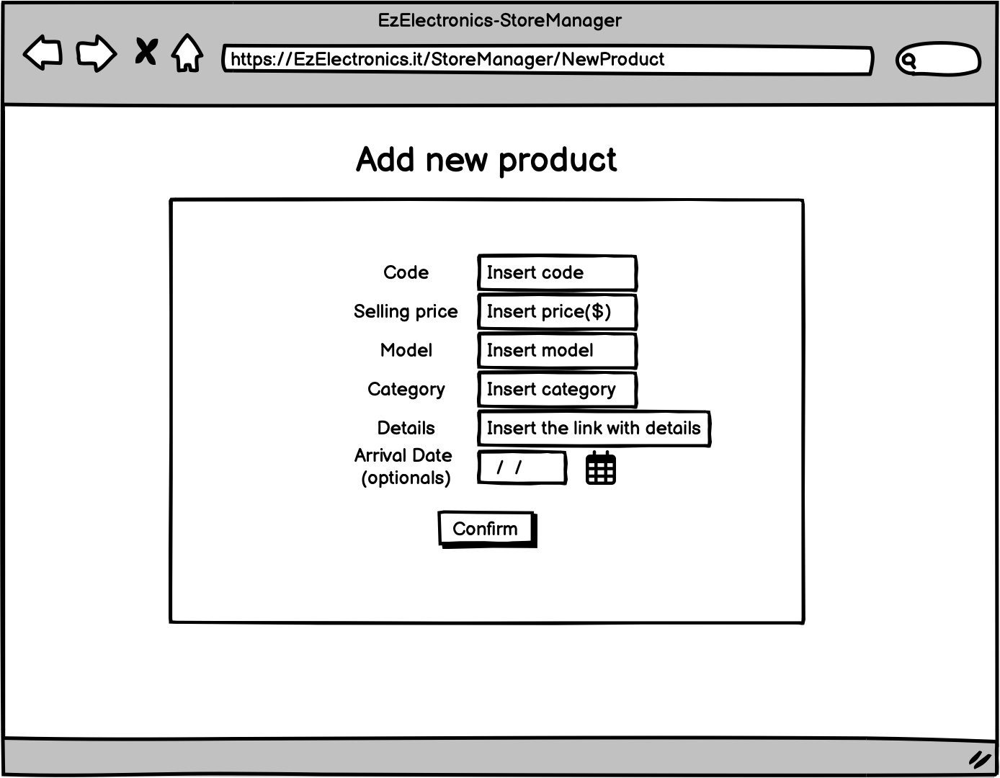
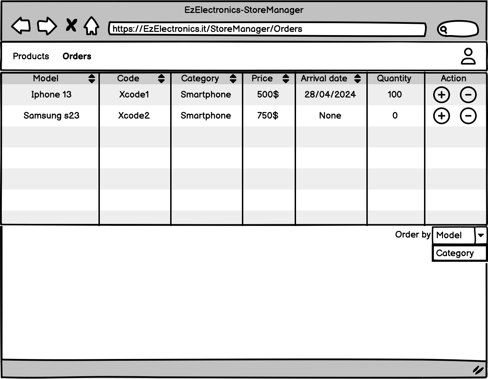

# Graphical User Interface Prototype - CURRENT

Authors: Francesco Puglisi, Luca Giusiano, Marco Profilo, Mirko Di Maggio

Date: 05/05/2024

Version: 1

## Autehntication

### Login 

    
    

### Registration 

    
    

## Customer

### List of all Products

    
    

### Products filtered by Model and Category

    
    

### Account info / Logout

    
    

### Current Cart - Info, Delete option, Payment, Historical Carts

    
    

### Current Cart - Account info / Logout

    
    

### Historical Cart

    
    

### Historical Cart - Account info / Logout

    
    

### Account info 

    
    

## GUI Customer PDF link
[GUI Customer PC](material/v1/GUI/Customer/Customer%20PC/V1%20Customer%20PC.pdf)

[GUI Customer Smartphone](material/v1/GUI/Customer/Customer%20Smartphone/V1%20Customer%20Smartphone.pdf)

## Store Manager

### Products Management

### List of products

    

### New Product

    

### Orders Management

    

## GUI Store Manager PDF link

[GUI Store Manager](material/v1/GUI/StoreManager/GUI_SM_V1.pdf)