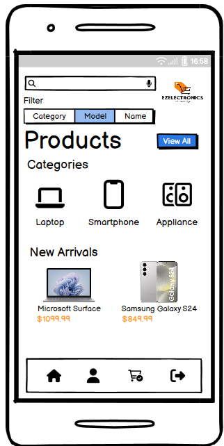
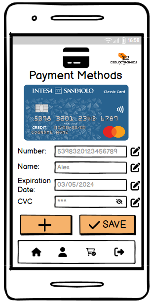

# Graphical User Interface Prototype - FUTURE

Authors: Francesco Puglisi, Luca Giusiano, Marco Profilo, Mirko Di Maggio

Date: 05/05/2024

Version: 1

## Mobile Application

### Sign IN / Sign UP / Sign OUT

    
    
    

### Home Page 

    

### Profile

    

### Cart

    
    

### Payment Methods

    
    

### All Products

    

### Categories

    
    
    

### Info Product

    
    

### Unknown User

    
    

    
    

## GUI Mobile App PDF link 
[GUI App Smartphone](material/v2/GUI/AppSmartphone/GUISmartphoneApp.pdf)

## Unknown User and Customer PC

### List of all Products

    

### Products filtered by Model and Category

    

### Login - Sign in - Privacy 

    

### Cookie 

    

    

### Login

    

### Sign in

    

## Customer PC

### List of all Products 

    

### Products filtered by Model and Category

    

### Account info and Logout

    

### Current Cart - Info, Delete option, Payment, Historical Carts

    

    

 
### Historical Cart - Track order

    

    

### Account info - Edit profile, List and management of Payment methods, Privacy and Cookie policy, Delete account

    

### Edit Profile

    

### Add Payment method

    

### Cookie and privacy policy

    

    

    

 

    

## Unknown User and Customer PC PDF link
[GUI Unknown User and Customer](material/v2/GUI/Unknown%20User%20and%20Customer/V2%20Unknown%20User%20-%20Customer%20PC.pdf)

## Store Manager

### Products Management

### List of products

    

### Create a new product

    

### Edit a Product

    

### Orders Management

    

### Edit Profile

    

### Stats Management

    

### List of Users management

    

### List of Store Manager management

    

### Registration Store Manager

    

## Store Manager PDF link
[GUI Store Manager](material/v2/GUI/StoreManager/GUI_SM_V2.pdf)

## Security Analyst

### Security Management

    

## Admin

### Register new Store Manager

    

### List of Store Manager

    

## Admin PDF link
[GUI Admin](material/v2/GUI/Admin/GUI_ADMIN_V2.pdf)