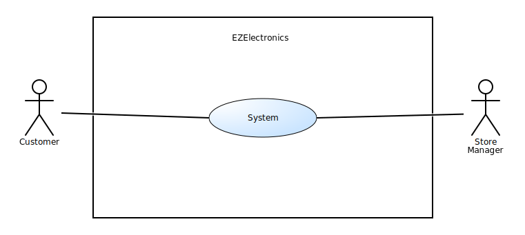
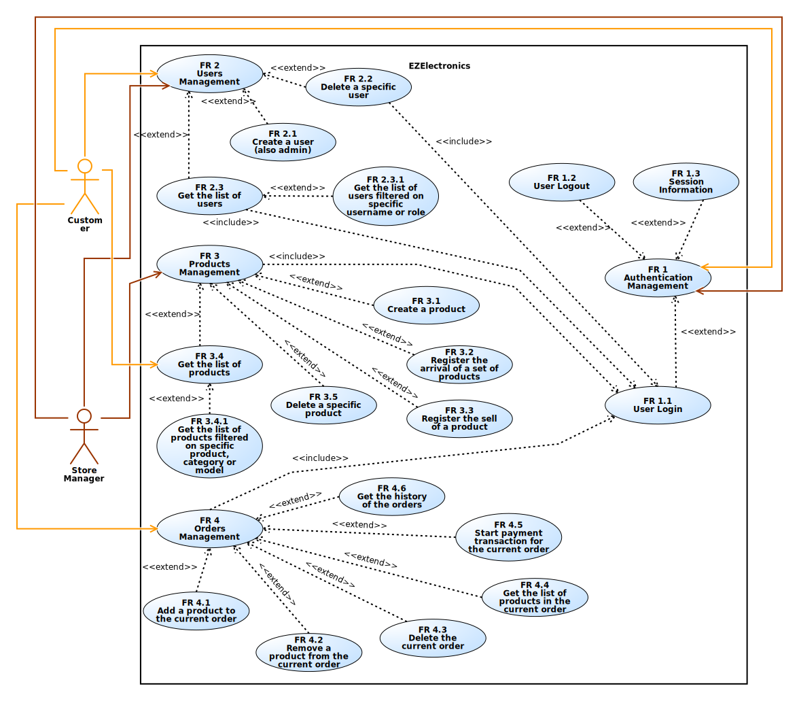
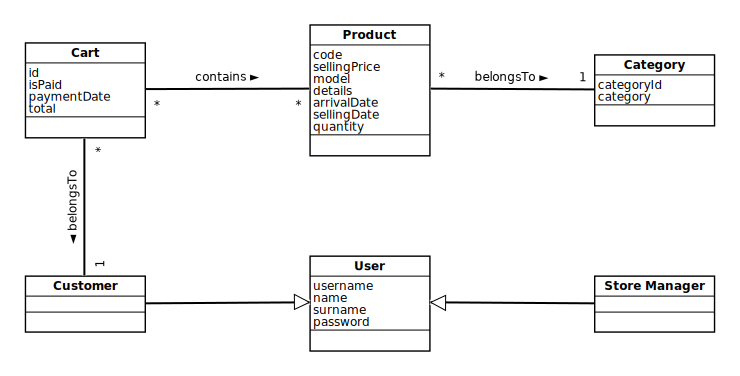
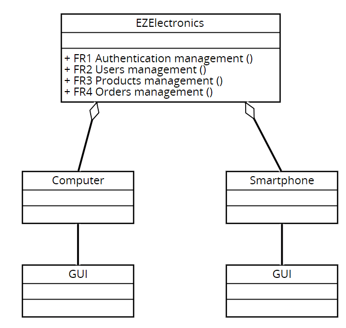
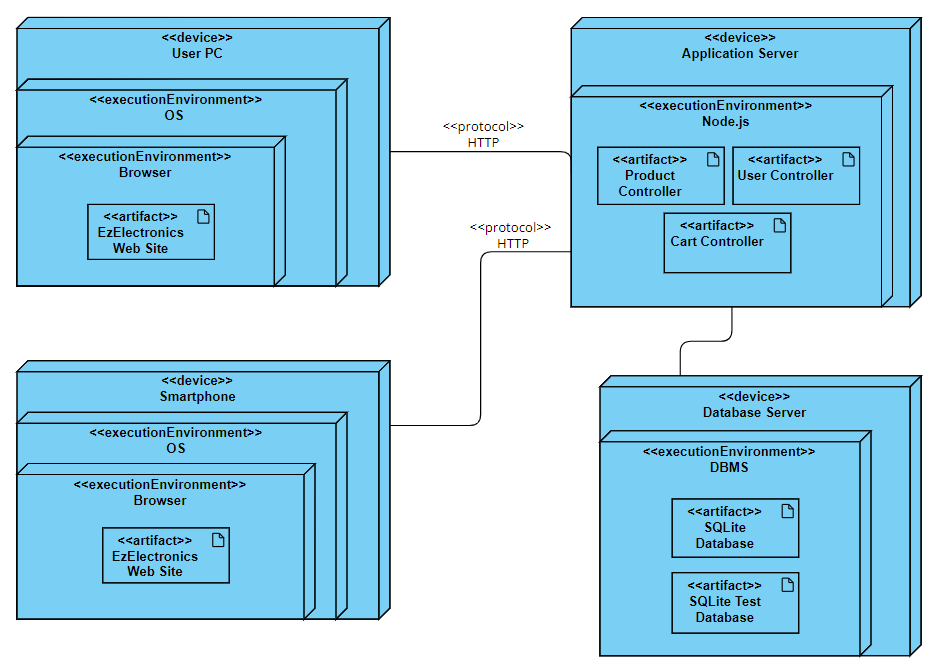

# Requirements Document - current EZElectronics

Date: 05/05/2024

Version: V1 - description of EZElectronics in CURRENT form (as received by teachers)

| Version number | Change |
| :------------: | :----: |
|       1        |        |

# Contents

- [Requirements Document - current EZElectronics](#requirements-document---current-ezelectronics)
- [Contents](#contents)
- [Informal description](#informal-description)
- [Stakeholders](#stakeholders)
- [Context Diagram and interfaces](#context-diagram-and-interfaces)
  - [Context Diagram](#context-diagram)
  - [Interfaces](#interfaces)
- [Stories and personas](#stories-and-personas)
- [Functional and non functional requirements](#functional-and-non-functional-requirements)
  - [Functional Requirements](#functional-requirements)
  - [Non Functional Requirements](#non-functional-requirements)
- [Use case diagram and use cases](#use-case-diagram-and-use-cases)
  - [Use case diagram](#use-case-diagram)
    - [Use case 1, UC1](#use-case-1-uc1)
      - [Scenario 1.1](#scenario-11)
      - [Scenario 1.2](#scenario-12)
      - [Scenario 1.3](#scenario-13)
    - [Use case 2, UC2](#use-case-2-uc2)
      - [Scenario 2.1](#scenario-21)
      - [Scenario 2.2](#scenario-22)
      - [Scenario 2.3](#scenario-23)
        - [Scenario 2.3.1](#scenario-231)
    - [Use case 3, UC3](#use-case-3-uc3)
      - [Scenario 3.1](#scenario-31)
      - [Scenario 3.2](#scenario-32)
      - [Scenario 3.3](#scenario-33)
      - [Scenario 3.4](#scenario-34)
      - [Scenario 3.5](#scenario-35)
        - [Scenario 3.5.1](#scenario-351)
    - [Use case 4, UC4](#use-case-4-uc4)
      - [Scenario 4.1](#scenario-41)
      - [Scenario 4.2](#scenario-42)
      - [Scenario 4.3](#scenario-43)
      - [Scenario 4.4](#scenario-44)
      - [Scenario 4.5](#scenario-45)
      - [Scenario 4.6](#scenario-46)
- [Glossary](#glossary)
- [System Design](#system-design)
- [Deployment Diagram](#deployment-diagram)

# Informal description

EZElectronics (read EaSy Electronics) is a software application designed to help managers of electronics stores to manage their products and offer them to customers through a dedicated website. Managers can access the available products, record new ones, and confirm purchases. Customers can see available products, add them to a cart and see the history of their past purchases.

# Stakeholders

| Stakeholder name             | Description                   |
| :--------------------------- | :---------------------------- |
| Store Managers               | Person that manages the store |
| Customers                    | Person that use the application |

# Context Diagram and interfaces

## Context Diagram

## Interfaces

|   Actor             | Physical Interface | Logical Interface |
| :-------            | :----------------  | :---------------- |
| Customer            | PC, Smartphone     | GUI (see available products, add products to a cart, see the history of their past purchase) |
| Store Manager       | PC                 | GUI (access available products, record new products)         |

# Stories and personas

### Persona 1: Sarah - Electronics Store Manager
> **Background**: Sarah is the manager of a small Electronics store.

> **Interaction with the system**: Sarah logs into the EzElectronics application daily to check product availability, manage orders, and track sales.
She utilizes features like product management to update inventory, order management to process incoming orders and sales analytics to monitor sales performance. She proceed to cash in the payment for the orders.

### Persona 2: Alex - Tech Customer
> **Background**: Alex is a customer who loves exploring the latest gadgets and electronics. He often shops online for new and exciting products.

> **Interaction with the system**: Alex visits the EZElectronics website to browse through the catalog of electronic products. He adds items to his shopping cart, reads product reviews, and finally proceeds to checkout setting the payment date. He likes to take a history of purchases.

# Functional and non functional requirements

## Functional Requirements

|  ID   | Description |
| :------------         | :------------------------ |
| FR 1                  | Authentication management |
| &emsp; FR 1.1         | &emsp; User login |
| &emsp; FR 1.2         | &emsp; User logout |
| &emsp; FR 1.3         | &emsp; Session information |
| FR 2                  | Users management |
| &emsp; FR 2.1         | &emsp; Create a user (also admin) |
| &emsp; FR 2.2         | &emsp; Delete a specific user |
| &emsp; FR 2.3         | &emsp; Get the list of users |
| &emsp;&emsp; FR 2.3.1 | &emsp;&emsp; Get the list of users filtered on specific username or role |
| FR 3                  | Products management |
| &emsp; FR 3.1         | &emsp; Create a product |
| &emsp; FR 3.2         | &emsp; Register the arrival of a set of products |
| &emsp; FR 3.3         | &emsp; Register the sell of a product |
| &emsp; FR 3.4         | &emsp; Get the list of products |
| &emsp;&emsp; FR 3.4.1 | &emsp;&emsp; Get the list of products filtered on specific product, category or model |
| &emsp; FR 3.5         | &emsp; Delete a specific product |
| FR 4                  | Orders management |
| &emsp; FR 4.1         | &emsp; Add a product to the current order |
| &emsp; FR 4.2         | &emsp; Remove a product from the current order |
| &emsp; FR 4.3         | &emsp; Delete the current order |
| &emsp; FR 4.4         | &emsp; Get the list of products in the current order |
| &emsp; FR 4.5         | &emsp; Start payment transaction for the current order |
| &emsp; FR 4.6         | &emsp; Get the history of the orders |

## Non Functional Requirements

|   ID    | Type           | Description | Refers to |
| :-----  | :--------------------------------  | :---------  |  :------- |
|  NFR 1   | Efficiency                         | Average response time of HTTP requests < 100 ms  | All functional requirements |
|  NFR 2.1   | Usability                          | User interface must be user-friendly, with an average learning time of 10 min  | All functional requirements |
| NFR 2.2       |    Usability                                | The application must provide immediate feedback on completed operations   | All functional requirements |
|  NFR 3   | Portability                        | The GUI must be responsive for mobile devices            | All functional requirements          |
| NFR 4.1 | Security | The system must comply with the General Data Protection Regulation (GDPR) | All functional requirements except FR 3 |
| NFR 4.2 | Security | Operations available in the system must be accessible only to authorized users | All functional requirements | 

# Use case diagram and use cases

## Use case diagram

### Use case 1, UC1

| Actors Involved  | Customer, Store Manager                                                                     |
| :--------------: | :------------------------------------------------------------------: |
|   Precondition   | Customer and Store Manager must have an accoount |
|  Post condition  | Customer or Store Manager will logged in or logged out  |
| Nominal Scenario | Authentication management         |
|    Exceptions    | If the username doesn't exit or password is incorrect returns error 409|

##### Scenario 1.1

Customer/Store Manager that has already an account decide to login to the system.

|  Scenario 1.1  |                                                                            |
| :------------: | :------------------------------------------------------------------------: |
|  Precondition  | Customer and Store Manager must have an accoount |
| Post condition | Customer and Store Manager will logged in   |
|       1        | Customer/Store Manager open the web site                                 |
|       2        | Web ask for login information|
|       3        | Customer/Store Manager enters account name, pswd |

##### Scenario 1.2
Customer/Store Manager that has already an account  and logged in decide to logout to the system.

|  Scenario 1.2  |                                                                            |
| :------------: | :------------------------------------------------------------------------: |
|  Precondition  | Customer/Store Manager must have logged in to the system |
| Post condition | Customer and Store Manager will logged out to the system   |
|       1        | Customer/Store Manager open the web site in his account and click the logout button                                 |
|       2        | Web ask for logout |
|       3        | Customer/Store Manager confirm logout |

##### Scenario 1.3
Customer/Store Manager that has already an account  and logged in decide to watch his account information.

|  Scenario 1.3  |                                                                            |
| :------------: | :------------------------------------------------------------------------: |
|  Precondition  | Customer/Store Manager must have logged in to the system |
| Post condition | Customer and Store Manager will watch his account information   |                                
|       1        | Customer/Store Manager open the web site in his account and click the account button                                 |
|       2        | Web show his account information |

### Use case 2, UC2

| Actors Involved  | Customer, Store Manager|
| :--------------: | :------------------------------------------------------------------: |
|   Precondition   | Customer and Store Manager don't have an accoount |
|  Post condition  | Customer or Store Manager will create/delete an account, Admin will see list of users, delete an account  |
| Nominal Scenario | Users management         |
|    Exceptions    |If the username already exist returns error 409|

##### Scenario 2.1
Customer/Store Manager decide to register an account to the system.

|  Scenario 2.1  |                                                                            |
| :------------: | :------------------------------------------------------------------------: |
|  Precondition  | Customer/Store Manager don't have an account |
| Post condition | Customer and Store Manager will have an account   |                              
|       1        | Customer/Store Manager open the web site and click the register button|
|       2        | Web show the registration form|
|       3        | Customer/Store Manager fill the form|
|       4        | Web show the confirmation with the recap of the form|
|       5        | Customer/Store Manager confirm|

##### Scenario 2.2
Cusstomer/Store Manager decide to delete his account to the system.

|  Scenario 2.2  |                                                                            |
| :------------: | :------------------------------------------------------------------------: |
|  Precondition  | Customer/Store Manager must have an account |
| Post condition | Customer and Store Manager will delete his account                         |
|       1        | Customer/Store Manager open the web site and click account button and select the delete account button|
|       2        | Web ask for delete|
|       3        | Customer/Store confirm delete|

##### Scenario 2.3
Customer/Store Manager decide to watch the list of users.

|  Scenario 2.3  |                                                                            |
| :------------: | :------------------------------------------------------------------------: |
|  Precondition  | Customer/Store Manager must be logged in to the system|
| Post condition | Customer/Store Manager will watch the list of users                |
|       1        | Customer/Store Manager select the option to visualize the list of users|
|       2        | The system retrieve the list of users from the database|
|       3        | The system show the list of users|

##### Scenario 2.3.1
Customer/Store Manager decide to watch the list of users with some filters.

|  Scenario 2.3.1  |                                                                            |
| :------------: | :------------------------------------------------------------------------: |
|  Precondition  | Customer/Store Manager must be logged in to the system|
| Post condition | Customer/Store Manager will watch the list of users with the specified filters                          |
|       1        | The Customer/Store Manager accesses the advanced user search feature|
|       2        | The Customer/Store Manager enters the desired filter policy (user name, role, etc.)|
|       3        | The system performs a filtered query on the user database|
|       4        | The system displays the list of users filtered according to the specified criteria|

### Use case 3, UC3

| Actors Involved  | Customer, Store Manager                                                                     |
| :--------------: | :------------------------------------------------------------------: |
|   Precondition   | Customer and Store Manager must be logged in to the system |
|  Post condition  | Store Manager will manage the detail of the products(create, delete,register the arrival, the sell of a product), Customer/Store Manager will see the list of products(also with some filters)|
| Nominal Scenario | Products Management         |

##### Scenario 3.1
Store Manager decide to create a new product.

|  Scenario 3.1  |                                                                            |
| :------------: | :------------------------------------------------------------------------: |
|  Precondition  | Store Manager must be logged in to the system|
| Post condition | Store Manager will add the new product|
|       1        | Store Manager select the option to create a new product|
|       2        | The system show the form to create a new product|
|       3        | The Store Manager fill the form and confirm|
|       4        | The system verifies and adds the product to the system|

##### Scenario 3.2
Store Manager decide to register the arrival of a set of products.

|  Scenario 3.2  |                                                                            |
| :------------: | :------------------------------------------------------------------------: |
|  Precondition  | Store Manager must be logged in to the system|
| Post condition | Store Manager will register the arrival of a set of products|
|       1        | Store Manager accesses the function of recording the arrival of a set of products|
|       2        | The store manager enters the details of the arrival of the products (date, quantity, product code, etc.)|
|       3        | The Store Manager confirm the arrival of the products|
|       4        | The system verifies and adds the arrival of the products to the system|

##### Scenario 3.3
Store Manager register the sell of a product.

|  Scenario 3.3  |                                                                            |
| :------------: | :------------------------------------------------------------------------: |
|  Precondition  | Store Manager must be logged in to the system|
| Post condition | Store Manager will register the sell of a product and the system set the status of the product as sold|
|       1        | Store Manager register the sell of all the specified product|
|       2        | The system set the status of the product as sold|

##### Scenario 3.4
Store Manager decide to delete a product.

|  Scenario 3.4  |                                                                            |
| :------------: | :------------------------------------------------------------------------: |
|  Precondition  | Store Manager must be logged in to the system|
| Post condition | Store Manager will remove the new product from the system|
|       1        | Store Manager select a specifc product to delete from the list of products|
|       2        | The store manager confirms the deletion|
|       3        | The system removes the product|

##### Scenario 3.5
Store Manager/Customer decide to watch the list of products.

|  Scenario 3.5  |                                                                            |
| :------------: | :------------------------------------------------------------------------: |
|  Precondition  | Store Manager/Customer must be logged in to the system|
| Post condition | Store Manager/Customer will watch the list of products|
|       1        | Store Manager/Customer select the option to visualize the list of products|
|       2        | The system retrieve the list of products from the database|
|       3        | The system show the list of products|

##### Scenario 3.5.1
Store Manager/Customer decide to watch the list of products with some filters.

|  Scenario 3.5.1  |                                                                            |
| :------------: | :------------------------------------------------------------------------: |
|  Precondition  | Store Manager/Customer must be logged in to the system|
| Post condition | Store Manager/Customer will watch the list of products with the specified filters|
|       1        | Store Manager/Customer select the option to visualize the list of products|
|       2        | Store Manager/Customer select the the filter to apply at the list of products|
|       3        | The system retrieve the list of products with the specified filter from the database|
|       4        | The system show the list of products filtered according to the specified criteria|

### Use case 4, UC4

| Actors Involved  | Customer                                                                     |
| :--------------: | :------------------------------------------------------------------: |
|   Precondition   | Customer must be logged in to the system |
|  Post condition  |Customer will had managed his orders |
| Nominal Scenario | Orders Management         |
|    Exceptions    |If the username doesn't exit or password is incorrect returns error 409|

##### Scenario 4.1

Customer decide to add a product to his cart.

|  Scenario 4.1  |                                                                            |
| :------------: | :------------------------------------------------------------------------: |
|  Precondition  | Customer must be logged in to the system|
| Post condition | Customer will have the updated cart|
|       1        | Customer select the option to add a product to his cart|
|       2        | The system show the form to add a product to his cart|
|       3        | The Customer fill the form with the quantity and confirm|
|       4        | The system verifies and adds the product to the cart|

##### Scenario 4.2

Customer decide to remove a product from his cart.

|  Scenario 4.2  |                                                                            |
| :------------: | :------------------------------------------------------------------------: |
|  Precondition  | Customer must be logged in to the system|
| Post condition | Customer will have the updated cart|
|       1        | Customer select the option to remove a product from his cart|
|       2        | The system ask the confirmation to remove a product from his cart|
|       3        | The Customer confirm the removal|
|       4        | The system verifies and removes the product from the cart|

##### Scenario 4.3

Customer decide to delete his cart.

|  Scenario 4.3  |                                                                            |
| :------------: | :------------------------------------------------------------------------: |
|  Precondition  | Customer must be logged in to the system|
| Post condition | Customer will have the updated cart|
|       1        | Customer select the option to delete his cart|
|       2        | The system ask the confirmation to delete his cart|
|       3        | The Customer confirm the deletion|
|       4        | The system verifies and deletes the cart|

##### Scenario 4.4

Customer to watch the list of products in the cart.

|  Scenario 4.4  |                                                                            |
| :------------: | :------------------------------------------------------------------------: |
|  Precondition  | Customer must be logged in to the system|
| Post condition | Customer will have list of products in the cart|
|       1        | Customer select the option to watch the list of products in the cart|
|       2        | The system retrieve the list of products in the cart from the database|
|       3        | The system show the list of products in the cart|

##### Scenario 4.5

Customer decide to pay for his cart.

|  Scenario 4.5  |                                                                            |
| :------------: | :------------------------------------------------------------------------: |
|  Precondition  | Customer must be logged in to the system|
| Post condition | Customer have in the history the order that have been payed|
|       1        | Customer select the option to pay for his cart|
|       2        | The system ask the confirmation to pay for his cart|
|       3        | The Customer confirm the payment|
|       4        | The system verifies and pay for the cart|

##### Scenario 4.6

Customer decide to watch his history of orders.

|  Scenario 4.6  |                                                                            |
| :------------: | :------------------------------------------------------------------------: |
|  Precondition  | Customer must be logged in to the system|
| Post condition | Customer will have his history of orders|
|       1        | Customer select the option to watch his history of orders|
|       2        | The system retrieve the history of orders from the database|
|       3        | The system show the history of orders|

# Glossary

# System Design

# Deployment Diagram

