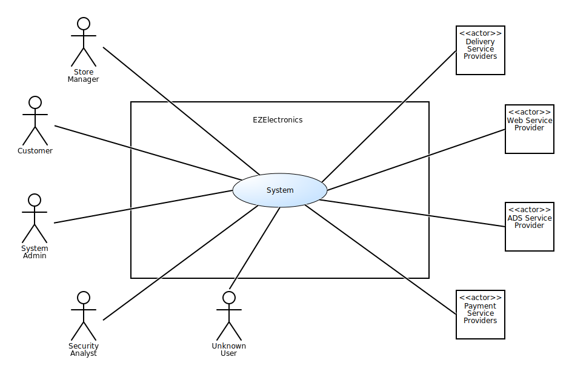
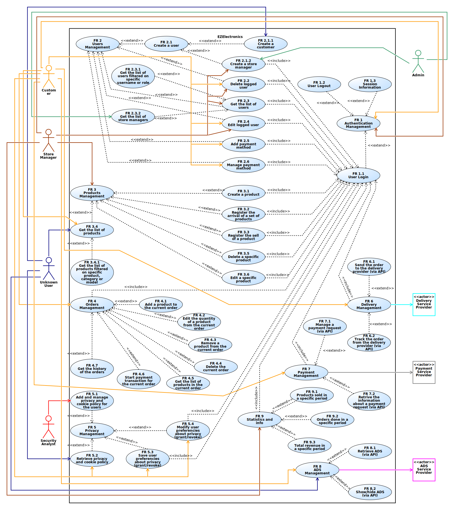
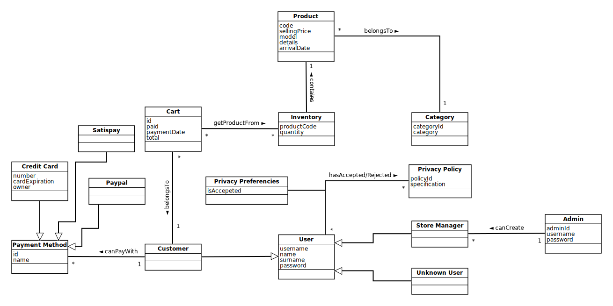
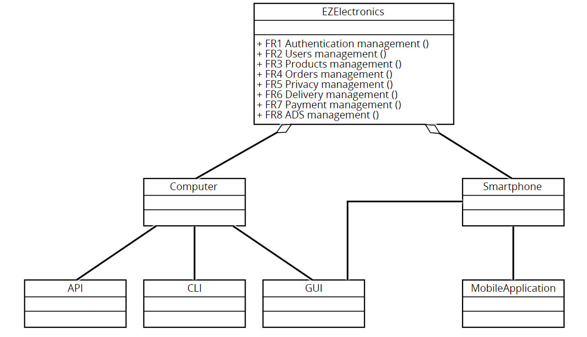
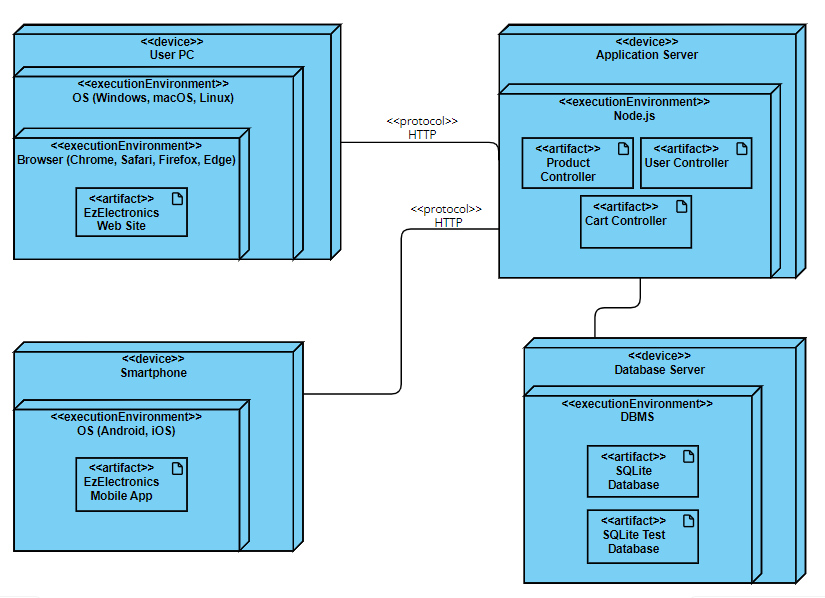

# Requirements Document - future EZElectronics

Date: 05/05/2024

Version: V2 - description of EZElectronics in FUTURE form (as proposed by the team)

| Version number | Change |
| :------------: | :----: |
|       1        |        |

# Contents

- [Requirements Document - future EZElectronics](#requirements-document---future-ezelectronics)
- [Contents](#contents)
- [Informal description](#informal-description)
- [Stakeholders](#stakeholders)
- [Context Diagram and interfaces](#context-diagram-and-interfaces)
  - [Context Diagram](#context-diagram)
  - [Interfaces](#interfaces)
- [Stories and personas](#stories-and-personas)
- [Functional and non functional requirements](#functional-and-non-functional-requirements)
  - [Functional Requirements](#functional-requirements)
  - [Non Functional Requirements](#non-functional-requirements)
- [Use case diagram and use cases](#use-case-diagram-and-use-cases)
  - [Use case diagram](#use-case-diagram)
    - [Use case 1, UC1](#use-case-1-uc1)
      - [Scenario 1.1](#scenario-11)
      - [Scenario 1.2](#scenario-12)
      - [Scenario 1.3](#scenario-13)
    - [Use case 2, UC2](#use-case-2-uc2)
      - [Scenario 2.1](#scenario-21)
        - [Scenario 2.1.1](#scenario-211)
        - [Scenario 2.1.2](#scenario-212)
      - [Scenario 2.2](#scenario-22)
      - [Scenario 2.3](#scenario-23)
        - [Scenario 2.3.1](#scenario-231)
        - [Scenario 2.3.2](#scenario-232)
      - [Scenario 2.4](#scenario-24)
      - [Scenario 2.5](#scenario-25)
      - [Scenario 2.6](#scenario-26)
    - [Use case 3, UC3](#use-case-3-uc3)
      - [Scenario 3.1](#scenario-31)
      - [Scenario 3.2](#scenario-32)
      - [Scenario 3.3](#scenario-33)
      - [Scenario 3.4](#scenario-34)
        - [Scenario 3.4.1](#scenario-341)
      - [Scenario 3.5](#scenario-35)
      - [Scenario 3.6](#scenario-36)
    - [Use case 4, UC4](#use-case-4-uc4)
      - [Scenario 4.1](#scenario-41)
      - [Scenario 4.2](#scenario-42)
      - [Scenario 4.3](#scenario-43)
      - [Scenario 4.4](#scenario-44)
      - [Scenario 4.5](#scenario-45)
      - [Scenario 4.6](#scenario-46)
      - [Scenario 4.7](#scenario-47)
    - [Use case 5, UC5](#use-case-5-uc5)
      - [Scenario 5.1](#scenario-51)
      - [Scenario 5.2](#scenario-52)
      - [Scenario 5.3](#scenario-53)
    - [Use case 6, UC6](#use-case-6-uc6)
      - [Scenario 6.1](#scenario-61)
      - [Scenario 6.2](#scenario-62)
    - [Use case 7, UC7](#use-case-7-uc7)
      - [Scenario 7.1](#scenario-71)
      - [Scenario 7.2](#scenario-72)
    - [Use case 8, UC6](#use-case-8-uc8)
      - [Scenario 8.1](#scenario-81)
      - [Scenario 8.2](#scenario-82)
    - [Use case 9, UC9](#use-case-9-uc9)
      - [Scenario 9.1](#scenario-91)
      - [Scenario 9.2](#scenario-92)
      - [Scenario 9.3](#scenario-93)
- [Glossary](#glossary)
- [System Design](#system-design)
- [Deployment Diagram](#deployment-diagram)

# Informal description

EZElectronics (read EaSy Electronics) is a software application designed to help managers of electronics stores to manage their products and offer them to customers through a dedicated website. Managers can assess the available products, record new ones, and confirm purchases. Customers can see available products, add them to a cart and see the history of their past purchases.

# Stakeholders

| Stakeholder name             | Description                   |
| :--------------------------- | :---------------------------- |
| CEO of stores group          | Person that leads the company that finances the project |
| Store Managers               | Person that manages the store |
| Customers                    | Person that buys products through the application |
| Unknown user (aggiungi a stories e personas)                | Person that can only watch the products |
| SW Factory                   | Software house that has created and that manage the application (front-end and back-end) |
| System Admins                | Persons that manage the server side of the application (DB and back-end) |
| Security Analyst             | Person that analize and provide the security of the application (GDPR, Third-parts data, ...) |
| Delivery Service Providers   | Companies that manage the delivery of the products (TNT, SPA, DHL, BRT, ...) |
| Payment Service Providers    | Companies that manage online payments transactions (PayPal, Google Pay, ...) |
| Web Service Provider         | Company that provide servers and IT infrastructure (AWS, Aruba, ...) |
| ADS Service Provider         | Companies that manage ADS (Google Ads, Meta Ads, Amazon Ads, ...) |

# Context Diagram and interfaces

## Context Diagram

## Interfaces

|   Actor             | Physical Interface | Logical Interface |
| :-------            | :----------------  | :---------------- |
| Customer            | PC, Smartphone     | GUI for PC, mobile application for smartphone (see available products, add products to a cart, see the history of their past purchase) |
| Store Manager       | PC                 | GUI (access available products, record new products)         |
| Unknown user        | PC                 | GUI for PC, mobile application for smartphone (see available products)         |
| System Admins       | PC                 | GUI, CLI
| Security Analyst    | PC                 | GUI, CLI
| Delivery Service Providers | Internet connection |API (https://developer.dhl.com, https://developer.fedex.com/api/it-it/home.html, ...) |
| Payment Service Providers  | Internet connection   | API (https://developers.google.com/pay/api, https://developer.visa.com/docs, ...)      | 
| Web Service Provider | Internet connection            | Website (https://aws.amazon.com/it/?nc2=h_lg, https://www.aruba.it/home.aspx, ...)  |
| ADS Service Provider | Internet connection            | API (https://developers.google.com/google-ads/api/docs/start?hl=it, ...)        |

# Stories and personas

### Persona 1: Sarah - Electronics Store Manager
> **Background**: Sarah is the manager of a small Electronics store.

> **Interaction with the system**: Sarah logs into the EzElectronics application daily to check product availability, manage orders, and track sales.
She utilizes features like product management to update inventory, order management to process incoming orders and sales analytics to monitor sales performance.

### Persona 2: Alex - Tech Customer
> **Background**: Alex is a customer who loves exploring the latest gadgets and electronics. He often shops online for new and exciting products.

> **Interaction with the system**: Alex visits the EZElectronics website to browse through the catalog of electronic products. He adds items to his shopping cart, reads product reviews, and finally proceeds to checkout. He likes to take a history of purchases.

### Persona 3: Emily - System Administator
> **Background**: Emily is a system administrator responsible for managing the server side of the EZElectronics application

> **Interaction with the system**: Emily monitors server performance, conducts maintenance tasks, and ensures data security and integrity. She troubleshoots technical issues and implements security measures to protect against potential threats.

### Persona 4: Ethan - Security Analyst
> **Background**:  Ethan is a security analyst responsible for assessing and enhancing the security of the EZElectronics application.

> **Interaction with the system**: Ethan conducts regular security audits, identifies vulnerabilities, and implements measures to mitigate risks. He ensures compliance with data protection regulations such as GDPR(General Data Protection Regulation) and monitors third-party data usage to safeguard customer privacy.

### Persona 5: Olivia - Delivery Service Provider Courier
> **Background**:  Olivia works for DHL service provider that collaborates with EZElectronics to deliver products to customers.

> **Interaction with the system**: Olivia use the system for update the tracking and delivery status of the order to the customer.

### Persona 6: John - Unknown User
> **Background**: John is an unknown user who wants to access the EZElectronics application.

> **Interaction with the system**: John is an unknown user who wants to access the EZElectronics application/website to check products availability.

# Functional and non functional requirements

## Functional Requirements

|  ID   | Description |
| :------------         | :------------------------ |
| FR 1                  | Authentication management |
| &emsp; FR 1.1         | &emsp; User login |
| &emsp; FR 1.2         | &emsp; User logout |
| &emsp; FR 1.3         | &emsp; Session information |
| FR 2                  | Users management |
| &emsp; FR 2.1         | &emsp; Create a user |
| &emsp;&emsp; FR 2.1.1 | &emsp; Create a customer |
| &emsp;&emsp; FR 2.1.2 | &emsp; Create a store manager |
| &emsp; FR 2.2         | &emsp; Delete logged user |
| &emsp; FR 2.3         | &emsp; Get the list of users |
| &emsp;&emsp; FR 2.3.1 | &emsp;&emsp; Get the list of users filtered on specific username or role |
| &emsp;&emsp; FR 2.3.2 | &emsp;&emsp; Get the list of the store managers |
| &emsp; FR 2.4         | &emsp; Edit logged user |
| &emsp; FR 2.5         | &emsp; Add a payment method |
| &emsp; FR 2.6         | &emsp; Manage payment methods |
| FR 3                  | Products management |
| &emsp; FR 3.1         | &emsp; Create a product |
| &emsp; FR 3.2         | &emsp; Register the arrival of a set of products |
| &emsp; FR 3.3         | &emsp; Register the sell of a product |
| &emsp; FR 3.4         | &emsp; Get the list of products |
| &emsp;&emsp; FR 3.4.1 | &emsp;&emsp; Get the list of products filtered on specific product, category or model |
| &emsp; FR 3.5         | &emsp; Delete a specific product |
| &emsp; FR 3.6         | &emsp; Edit a specific product |
| FR 4                  | Orders management (only for customers) |
| &emsp; FR 4.1         | &emsp; Add a product to the current order |
| &emsp; FR 4.2         | &emsp; Edit the quantity of a product from the current order |
| &emsp; FR 4.3         | &emsp; Remove a product from the current order |
| &emsp; FR 4.4         | &emsp; Delete the current order |
| &emsp; FR 4.5         | &emsp; Get the list of products in the current order |
| &emsp; FR 4.6         | &emsp; Start payment transaction for the current order |
| &emsp; FR 4.7         | &emsp; Get the history of the orders |
| FR 5                  | Privacy management |
| &emsp; FR 5.1         | &emsp; Add and manage privacy and cookie policy for the users |
| &emsp; FR 5.2         | &emsp; Retrieve privacy and cookie policy |
| &emsp; FR 5.3         | &emsp; Save user preferencies about privacy (grant/revoke) |
| &emsp; FR 5.4         | &emsp; Modify user preferencies about privacy (grant/revoke) |
| FR 6                  | Delivery management |
| &emsp; FR 6.1         | &emsp; Send the order to the delivery provider (via API) |
| &emsp; FR 6.2         | &emsp; Track the order to the delivery provider (via API) |
| FR 7                  | Payment management |
| &emsp; FR 7.1         | &emsp; Manage a payment request (via API) |
| &emsp; FR 7.2         | &emsp; Retrive the information about a payment request (via API) |
| FR 8                  | ADS management |
| &emsp; FR 8.1         | &emsp; Retrieve ADS (via API) |
| &emsp; FR 8.2         | &emsp; Show/hide ADS (via API) |
| FR 9                  | Statistics and info  |
| &emsp; FR 9.1         | &emsp; Products sold in a specific period |
| &emsp; FR 9.2         | &emsp; Orders done in a specific period |
| &emsp; FR 9.3         | &emsp; Total revenue in a specific period |

## Non Functional Requirements

|   ID    | Type | Description | Refers to |
| :------- | :-------------------------------- | :--------- | :------- |
|  NFR 1.1   | Efficiency                         | Average response time of HTTP requests < 0.2 s  | All functional requirements |
|  NFR 1.2   | Efficiency                         | All system features must complete in less than 0.1 s(excluding the network)  | All functional requirements |
|  NFR 1.3   | Efficiency                         | The system should not require more than 200 MB of disk space| All functional requirements |
|  NFR 1.4   | Efficiency                         | The system must not use more than 150 MB of RAM | All functional requirements |
|  NFR 2.1   | Usability                          | User interface must be user-friendly, with an average learning time of 10 min  | All functional requirements |
| NFR 2.2   |  Usability                                  | The apllication must provide immediate feedback on completed operations   | All functional requirements |
|  NFR 3.1   | Portability                        | The GUI must be responsive for mobile devices            | All functional requirements          |
|  NFR 3.2   | Portability                        | The app must be compatible with modern web browsers, including Chrome (from Chrome 80), Firefox (from Firefox 80), Safari (from Safari 13.1) and Edge (from Edge 80)| All functional requirements          |
|  NFR 3.3   | Portability                        | The app must be able to run on different operating systems, including Windows (from Windows 8), macOS (from macOS Sierra), Linux (from Kernel Linux 4.18) | All functional requirements |
|  NFR 3.4   | Portability                        | The system must be portable and work on both Android (from Android 9) and iOS (from iOS 15) mobile devices | All functional requirements |
| NFR 4.1 | Security | The system must comply with the General Data Protection Regulation (GDPR) | All functional requirements except FR 3 |
| NFR 4.2 | Security | Operations available in the system must be accessible only to authorized users | All functional requirements |
| NFR 4.3 | Security                               | The system must be able to protect sensitive data from malicious accesses      | All functional requirements, with exception for FR3 and FR8  |
|  NFR 5.1  | Reliability    | Bug reports must be limited to one per user per year  | All functional requirements    |
| NFR 5.2       | Reliability               | The system should not requiere more than 2 maintenance intervention per year | All functional requirements | 
| NFR 5.3    | Reliability     | The system should have an uptime per year of 99% | All functional requirements | 
| NFR 5.4    | Reliability     | The system must automatically perform a full backup of critical data every 24 hours | All functional requirements |
| NFR 6.1    | Maintainability | Effort (person hours) needed to add/modify/cancel a software function must not exceed 30 hours | All functional requirements |
| NFR 6.2    | Maintainability | Effort to fix a defect must not exceed 15 hours | All functional requirements |

# Use case diagram and use cases

## Use case diagram

### Use case 1, UC1

| Actors Involved  | Customer, Store Manager                                              |
| :--------------: | :------------------------------------------------------------------: |
|   Precondition   | Customer and Store Manager must have an accoount |
|  Post condition  | Customer or Store Manager will logged in or logged out  |
| Nominal Scenario | Authentication management         |
|    Exceptions    | If the username doesn't exit or password is incorrect returns error 409|

##### Scenario 1.1

Customer/Store Manager that has already an account decide to login to the system.

|  Scenario 1.1  |                                                                            |
| :------------: | :------------------------------------------------------------------------: |
|  Precondition  | Customer and Store Manager must have an accoount |
| Post condition | Customer and Store Manager will logged in   |
|     Step#      |                                Description                                 |
|       1        | Customer/Store Manager open the web site                                 |
|       2        | Web ask for login information|
|       3        | Customer/Store Manager enters account name, pswd |

##### Scenario 1.2
Customer/Store Manager that has already an account and logged in decide to logout to the system.

|  Scenario 1.2  |                                                                            |
| :------------: | :------------------------------------------------------------------------: |
|  Precondition  | Customer/Store Manager must have logged in to the system |
| Post condition | Customer and Store Manager will logged out to the system   |
|     Step#      |                                Description                                 |
|       1        | Customer/Store Manager open the web site in his account and click the logout button                                 |
|       2        | Web ask for logout |
|       3        | Customer/Store Manager confirm logout |

##### Scenario 1.3
Customer/Store Manager that has already an account and logged in decide to watch his account information.

|  Scenario 1.3  |                                                                            |
| :------------: | :------------------------------------------------------------------------: |
|  Precondition  | Customer/Store Manager must have logged in to the system |
| Post condition | Customer and Store Manager will watch his account information   |                                 
|       1        | Customer/Store Manager open the web site in his account and click the account button                                 |
|       2        | Web show his account information |

### Use case 2, UC2

| Actors Involved  | Customer, Store Manager, Unknown User, Admin                         |
| :--------------: | :------------------------------------------------------------------: |
|   Precondition   | Customer and Store Manager don't have an accoount |
|  Post condition  | Customer or Store Manager will create/delete an account, Admin will see list of users, delete an account  |
| Nominal Scenario | Users management         |
|    Exceptions    |If the username already exist returns error 409|
|        |If the username does not exist returns error 404|

##### Scenario 2.1
Unknown user/Store Manager decide to register an account to the system.

|  Scenario 2.1  |                                                                            |
| :------------: | :------------------------------------------------------------------------: |
|  Precondition  | Unknown user/Store Manager don't have an account |
| Post condition | Unknown user and Store Manager will have an account   |                                 
|       1        | Unknown user/Store Manager open the web site or the mobile application and click the register button|
|       2        | Web or app show the registration form|
|       3        | Unknown user/Store Manager fill the form|
|       4        | Web or app show the confirmation with the recap of the form|
|       5        | Unknown user/Store Manager confirm|

##### Scenario 2.1.1
Unknown User decide to register an account to the system.

|  Scenario 2.1.1  |                                                                            |
| :------------: | :------------------------------------------------------------------------: |
|  Precondition  | Unknown User don't have an account |
| Post condition | Customer will have an account  |                                 
|       1        | Unknown User open the web site or the mobile application and click the register button|
|       2        | Web or app show the registration form|
|       3        | Unknown User fill the form selecting 'customer' in the role-checkbox|
|       4        | Web or app show the confirmation with the recap of the form|
|       5        | Unknown User confirm|

##### Scenario 2.1.2
Admin/Store Manager decide to register an Store Manager account to the system.

|  Scenario 2.1.2  |                                                                            |
| :------------: | :------------------------------------------------------------------------: |
|  Precondition  | Admin/Store Manager must be logged in to the system |
| Post condition | Store Manager will have an account  |                                 
|       1        | Admin/Store Manager open the web site and click the register button for a Store Manager|
|       2        | Web show the registration form|
|       3        | Admin/Store Manager fill the form selecting 'store manager' in the role-checkbox|
|       4        | Web show the confirmation with the recap of the form|
|       5        | Admin/Store Manager confirm|

##### Scenario 2.2
Customer/Store Manager decide to delete his account to the system.

|  Scenario 2.2  |                                                                            |
| :------------: | :------------------------------------------------------------------------: |
|  Precondition  | Customer/Store Manager must have an account and must be logged in |
| Post condition | Customer/Store Manager will delete his account                         |
|       1        | Customer/Store Manager open the web site or mobile app and click account button and select the delete account button|
|       2        | Web or app ask for delete|
|       3        | Customer/Store Manager confirm delete|

##### Scenario 2.3
Admin/Store Manager decide to watch the list of users.

|  Scenario 2.3  |                                                                            |
| :------------: | :------------------------------------------------------------------------: |
|  Precondition  | Admin must be logged in to the system|
| Post condition | Admin will watch the list of users                |
|       1        | Admin select the option to visualize the list of users|
|       2        | The system retrieve the list of users from the database|
|       3        | The system show the list of users|

##### Scenario 2.3.1
Store Manager decide to watch the list of users with some filters.

|  Scenario 2.3.1  |                                                                            |
| :------------: | :------------------------------------------------------------------------: |
|  Precondition  | Store Manager must be logged in to the system|
| Post condition | Store Manager will watch the list of users with the specified filters                          |
|       1        | The Store Manager accesses the advanced user search feature|
|       2        | The Store Manager enters the desired filter policy (user name, role, etc.)|
|       3        | The system performs a filtered query on the user database|
|       4        | The system displays the list of users filtered according to the specified criteria|

##### Scenario 2.3.2
Admin decide to watch the list of store managers.

|  Scenario 2.3.2  |                                                                            |
| :------------: | :------------------------------------------------------------------------: |
|  Precondition  | Admin must be logged in to the system|
| Post condition | Admin will watch the list of store managers                          |
|       1        | Admin select the option to visualize the list of store managers|
|       2        | The system retrieve the list of store managers from the database|
|       3        | The system show the list of store managers|

##### Scenario 2.4
Customer/Store Manager decide to edit his profile.

|  Scenario 2.4  |                                                                            |
| :------------: | :------------------------------------------------------------------------: |
|  Precondition  | Customer/Store Manager must be logged in to the system|
| Post condition | Customer/Store Manager will have modified their profile                |
|       1        | Customer/Store Manager select the edit button in his profile section|
|       2        | The system show the edit form|
|       3        | Customer/Store Manager fills in the fields to be edited |
|       3        | Customer/Store Manager pressess the save button |

##### Scenario 2.5
Customer decide to add the payment method.

|  Scenario 2.5  |                                                                            |
| :------------: | :------------------------------------------------------------------------: |
|  Precondition  | Customer must be logged in to the system|
| Post condition | Customer will have a payment method                |
|       1        | Customer select the button to add new payment method in his profile section|
|       2        | The system show the form|
|       3        | Customer fills all the fields |
|       3        | Customer pressess the save button |

##### Scenario 2.6
Customer decide to manage his payment methods.

|  Scenario 2.6  |                                                                            |
| :------------: | :------------------------------------------------------------------------: |
|  Precondition  | Customer must be logged in to the system |
| Post condition | Customer will have managed their payment methods |
|       1        | Customer select the button to show payment method in his profile section|
|       2        | The system show the information of payment method|
|       3        | Customer modifies the necessary fields |
|       3        | Customer pressess the save button |

### Use case 3, UC3

| Actors Involved  | Customer, Store Manager, Unknown User                                |
| :--------------: | :------------------------------------------------------------------: |
|   Precondition   | Customer and Store Manager must be logged in to the system           |
|  Post condition  | Store Manager will manage the detail of the products(create, delete,register the arrival, the sell of a product), Customer/Store Manager/Unknown User will see the list of products(also with some filters)|
| Nominal Scenario | Products Management         |
|    Exceptions    |If the product already exist returns error 409|
|                  |If the code does not represent a product in the database returns error 404|
|                  |If the arrivalDate is after the current date  returns an error|
|                  |If the sellinDate is after the current date  returns an error|
|                  |If the sellingDate is before the arrivalDate  returns an error|
|                  |If the product has already been sold returns an error|

##### Scenario 3.1
Store Manager decide to create a new product.

|  Scenario 3.1  |                                                                            |
| :------------: | :------------------------------------------------------------------------: |
|  Precondition  | Store Manager must be logged in to the system|
| Post condition | Store Manager will add the new product|
|       1        | Store Manager select the option to create a new product|
|       2        | The system show the form to create a new product|
|       3        | The Store Manager fill the form and confirm|
|       4        | The system verifies and adds the product to the system|

##### Scenario 3.2
Store Manager decide to register the arrival of a set of products.

|  Scenario 3.2  |                                                                            |
| :------------: | :------------------------------------------------------------------------: |
|  Precondition  | Store Manager must be logged in to the system|
| Post condition | Store Manager will register the arrival of a set of products|
|       1        | Store Manager accesses the function of recording the arrival of a set of products|
|       2        | The store manager enters the details of the arrival of the products (date, quantity, product code, etc.)|
|       3        | The Store Manager confirm the arrival of the products|
|       4        | The system verifies and adds the arrival of the products to the system|

##### Scenario 3.3
Store Manager register the sell of a product.

|  Scenario 3.3  |                                                                            |
| :------------: | :------------------------------------------------------------------------: |
|  Precondition  | Store Manager must be logged in to the system|
| Post condition | Store Manager will register the sell of a product and the system set the status of the product as sold|
|       1        | Store Manager register the sell of all the specified product|
|       2        | The system set the status of the product as sold|

##### Scenario 3.4
Customer/Unknonw/Store Manager User decide to watch the list of products.

|  Scenario 3.4  |                                                                            |
| :------------: | :------------------------------------------------------------------------: |
|  Precondition  | Customer/Store Manager must be logged in to the system|
| Post condition | Customer/Unknonw/Store Manager will watch the list of products|
|       1        | Customer/Unknonw/Store Manager select the option or button to visualize the list of products|
|       2        | The system retrieve the list of products from the database|
|       3        | The system show the list of products|

##### Scenario 3.4.1
Customer/Unknonw/Store Manager decide to watch the list of products with some filters.

|  Scenario 3.4.1|                                                                            |
| :------------: | :------------------------------------------------------------------------: |
|  Precondition  | Customer/Store Manager must be logged in to the system|
| Post condition | Customer/Unknonw/Store Manager will watch the list of products with the specified filters|
|       1        | Customer/Unknonw/Store Manager select the option or button to visualize the list of products|
|       2        | Customer/Unknonw/Store Manager select the the filter to apply at the list of products|
|       3        | The system retrieve the list of products with the specified filter from the database|
|       4        | The system show the list of products filtered according to the specified criteria|

##### Scenario 3.5
Store Manager decide to delete a product.

|  Scenario 3.5  |                                                                            |
| :------------: | :------------------------------------------------------------------------: |
|  Precondition  | Store Manager must be logged in to the system|
| Post condition | Store Manager will remove the new product from the system|
|       1        | Store Manager select a specifc product to delete from the list of products|
|       2        | The store manager confirms the deletion|
|       3        | The system removes the product|

##### Scenario 3.6
Store Manager decide to edit a product.

|  Scenario 3.6  |                                                                            |
| :------------: | :------------------------------------------------------------------------: |
|  Precondition  | Store Manager must be logged in to the system|
| Post condition | Store Manager will have edited the product|
|       1        | Store Manager select a specifc product to edit from the list of products|
|       2        | Store Manager edits the fields of the selected product |
|       3        | The system modifies the selected product |

### Use case 4, UC4

| Actors Involved  | Customer                                                             |
| :--------------: | :------------------------------------------------------------------: |
|   Precondition   | Customer must be logged in to the system                             |
|  Post condition  | Customer will had managed his orders                                 |
| Nominal Scenario | Orders Management                                                     |
|    Exceptions    | If the username doesn't exit or password is incorrect returns error 409|
|                  | If the customer does not have a cart and decide to pay returns error 404|
|                  | If the customer decide to pay an empty cart returns error 404|
|                  | If the productId represent a product that is not in the cart returns error 404|
|                  | If the productId does not represent an existing product returns error 404|
|                  | If the productId represent a product that has already been sold returns error 404|

##### Scenario 4.1

Customer decide to add a product to his current cart.

|  Scenario 4.1  |                                                                            |
| :------------: | :------------------------------------------------------------------------: |
|  Precondition  | Customer must be logged in to the system|
| Post condition | Customer will have the updated cart|
|       1        | Customer select the option to add a product to his cart|
|       2        | The System show the form to add a product to his cart|
|       3        | The Customer fill the form with the quantity and confirm|
|       4        | The System verifies and adds the product to the cart|

##### Scenario 4.2

Customer decide to edit the quantity of a product in his current cart.

|  Scenario 4.2  |                                                                            |
| :------------: | :------------------------------------------------------------------------: |
|  Precondition  | Customer must be logged in to the system|
| Post condition | Customer will have modified the quantity of a product in his cart |
|       1        | Customer select the option to show the current cart|
|       2        | The System show the current cart|
|       3        | The Customer interact with the button to modify the quantity of a product|
|       4        | The System increases or decreases the quantity of a product in the cart|

##### Scenario 4.3

Customer decide to remove a product from his current cart.

|  Scenario 4.3  |                                                                            |
| :------------: | :------------------------------------------------------------------------: |
|  Precondition  | Customer must be logged in to the system|
| Post condition | Customer will have the updated cart|
|       1        | Customer select the option to remove a product from his cart|
|       2        | The system ask the confirmation to remove a product from his cart|
|       3        | The Customer confirm the removal|
|       4        | The system verifies and removes the product from the cart|

##### Scenario 4.4

Customer decide to delete his current cart.

|  Scenario 4.4  |                                                                            |
| :------------: | :------------------------------------------------------------------------: |
|  Precondition  | Customer must be logged in to the system|
| Post condition | Customer will have the updated cart|
|       1        | Customer select the option or button to delete his cart|
|       2        | The system ask the confirmation to delete his cart|
|       3        | The Customer confirm the deletion|
|       4        | The system verifies and deletes the cart|

##### Scenario 4.5

Customer to watch the list of products in the current cart.

|  Scenario 4.5  |                                                                            |
| :------------: | :------------------------------------------------------------------------: |
|  Precondition  | Customer must be logged in to the system|
| Post condition | Customer will have list of products in the cart|
|       1        | Customer select the option or button to watch the list of products in the cart|
|       2        | The system retrieve the list of products in the cart from the database|
|       3        | The system show the list of products in the cart|

##### Scenario 4.6

Customer decide to pay for his current cart.

|  Scenario 4.6  |                                                                            |
| :------------: | :------------------------------------------------------------------------: |
|  Precondition  | Customer must be logged in to the system|
| Post condition | Customer have in the history the order that have been payed|
|       1        | Customer select the option to pay for his cart|
|       2        | The system ask the confirmation to pay for his cart|
|       3        | The Customer confirm the payment|
|       4        | The system verifies and pay for the cart|

##### Scenario 4.7

Customer decide to watch his history of orders.

|  Scenario 4.7  |                                                                            |
| :------------: | :------------------------------------------------------------------------: |
|  Precondition  | Customer must be logged in to the system|
| Post condition | Customer will have his history of orders|
|       1        | Customer select the option to watch his history of orders|
|       2        | The system retrieve the history of orders from the database|
|       3        | The system show the history of orders|

### Use case 5, UC5
| Actors Involved  | Unknown User, Customer, Security Analist                             |
| :--------------: | :------------------------------------------------------------------: |
|   Precondition   | Customer must be logged in to the system |
|  Post condition  | Preferences and cookie policy will be managed           |
| Nominal Scenario | Privacy management         |

##### Scenario 5.1

Security Analist adds and manages the customer's privacy and his cookie policy

|  Scenario 5.1  |                                                                            |
| :------------: | :------------------------------------------------------------------------: |
|  Precondition  | Security Analist is authorized and has permission to add or manage privacy and cookie policies for customers|
| Post condition | privacy and cookie policy will be added or modified for the Customer or Unknown User     |
|       1        | The Security Analyst selects the option to add or manage the privacy and cookie policies |
|       2        | The system displays the list of existing policies or an interface to add a new policy    |
|       3        | The Security Analyst add a new policy or modify an existing policy                       |
|       4        | The system updates the existing policy and records the new policy with the new modifications|

##### Scenario 5.2

Customer/Unknown User retrieve the privacy and cookie policy

|  Scenario 5.2  |                                                                            |
| :------------: | :------------------------------------------------------------------------: |
|  Precondition  | Customer must be logged in to the system |
| Post condition | Customer/Unknown User views his privacy and cookie policies|
|       1        | Customer accesses the system and the section dedicated to managing his privacy and cookie policies|
|       2        | Customer selects the option to retrieve the privacy and cookie policy|
|       3        | The system retrieves and show the privacy and cookie policy from database|

##### Scenario 5.3

Customer decide to save his privacy preferences

|  Scenario 5.3  |                                                                            |
| :------------: | :------------------------------------------------------------------------: |
|  Precondition  | Customer must be logged in to the system |
| Post condition | The customer's privacy preferences have been saved and updated in the system|
|       1        | Customer accesses the system and the section dedicated to managing preferencies about privacy|
|       2        | Customer selects the option to save the preferencies about privacy |
|       3        | The system records the new preferences of the Customer/Unknown User|

##### Scenario 5.4

Customer decide to modify his privacy preferences, deciding whether to grant or revoke consent

|  Scenario 5.4  |                                                                            |
| :------------: | :------------------------------------------------------------------------: |
|  Precondition  | Customer must be logged in to the system |
|                | The Customer has already saved their privacy preferences in the system in the past |
| Post condition | The privacy preferences of the Customer have been updated in the system|
|       1        | Customer accesses the system and the section dedicated to managing preferencies about privacy|
|       2        | Customer selects the option to modify the preferencies about privacy |
|       3        | Customer modifies the existing preferences, deciding whether to grant or revoke consent on privacy|
|       4        | The system updates the preferences of Customer with the changes made |

### Use case 6, UC6
| Actors Involved  | Customer, Delivery Service Provider                                  |
| :--------------: | :------------------------------------------------------------------: |
|   Precondition   | Customer must be logged in to the system |
|  Post condition  | Delivery Service Providers will receive the delivery and order tracking instructions |
| Nominal Scenario | Delivery management         |

##### Scenario 6.1

Customer send the order to the delivery provider.

|  Scenario 6.1  |                                                                            |
| :------------: | :------------------------------------------------------------------------: |
|  Precondition  | Customer must be logged in to the system |
|                | The Delivery Service Provider is integrated with the system through an API to receive the orders |
|                | Customer has completed the purchase process |
| Post condition | The order has been successfully transmitted to the Delivery Service |
|       1        | Customer completes the purchase process on the website or the mobile application |
|       2        | The System processes the order |
|       3        | The System sends the order information (delivery address and purchased products) to the Delivery Service Provider via API|
|       4        | Delivery Service Provider receives the order information and records it in their system |

##### Scenario 6.2

Customer track the order to the delivery provider.

|  Scenario 6.2  |                                                                            |
| :------------: | :------------------------------------------------------------------------: |
|  Precondition  | Customer must be logged in to the system |
|                | The Delivery Service Provider is integrated with the system through an API to track the orders |
|                | Customer has completed the purchase process |
| Post condition | Customer has successfully tracked the order to the delivery service provider|
|       1        | Customer clicks on the link or button to track the status of the order|
|       2        | Customer enters the necessary information for tracking the order |
|       3        | The Delivery Service Provider retrieves the customer's order information and displays the current delivery status|
|       4        | The Delivery Service Provider provides the tracking information for the order via the API |
|       5        | Customer views the current delivery status provided by the delivery service provider |

### Use case 7, UC7
| Actors Involved  | Customer, Payment Service Providers                                  |
| :--------------: | :------------------------------------------------------------------: |
|   Precondition   | Customer must be logged in to the system |
|                  | The Payment Service Providers have integrated a payment management API with the system |
|  Post condition  | The payment request has been successfully processed by the Payment Service Providers |
| Nominal Scenario | Payment management         |

##### Scenario 7.1

Payment Service Providers manage a payment request

|  Scenario 6.1  |                                                                            |
| :------------: | :------------------------------------------------------------------------: |
|  Precondition  | Customer must be logged in to the system                                   |
|                | The Payment Service Providers have integrated a payment management API with the system |
|                | Customer has already created the order and clicked on the 'pay' button |
| Post condition | Payment Service Providers will process the payment|
|       1        | Customer selects the desired payment method from the available options |
|       2        | The System redirects the Customer to the website of the Payment Service Provider to complete the payment |
|       3        | The System sends the payment request to the API of the Payment Service Provider |
|                | The Payment Service Provider processes the transaction and generates a confirmation response  |

##### Scenario 7.2

Payment Service Providers retrieve the information about a payment request

|  Scenario 7.2  |                                                                            |
| :------------: | :------------------------------------------------------------------------: |
|  Precondition  | Customer must be logged in to the system |
|                | The Payment Service Providers have integrated a payment management API with the system |
|                | Customer has completed a payment transaction                                           |
| Post condition | Customer will have successfully retrieved the payment request information |
|       1        | Customer accesses the System or mobile app to manage the payment request.|
|       2        | The System sends a request to retrieve payment request information to Payment Service Provider via API |
|       3        | The Payment Service Providers processes the request and retrieves the transaction details |
|       4        | The Payment Service Providers returns the retrieved information to the online store system or application as an API response |
|                | The System shows the payment request information to the customer |

### Use case 8, UC8
| Actors Involved  | Unknown User, Customer, ADS Service Provider                         |
| :--------------: | :------------------------------------------------------------------: |
|   Precondition   | Customer must be logged in to the system |
|                  | The ADS Service Provider has integrated a ADS management API with the system |
|  Post condition  | The ADS request has been successfully processed by the ADS Service Provider |
| Nominal Scenario | ADS management         |

##### Scenario 8.1

Customer/Unknown User want to view the advertisements

|  Scenario 8.1  |                                                                            |
| :------------: | :------------------------------------------------------------------------: |
|  Precondition  | Customer must be logged in to the system |
|                | The ADS Service Provider has integrated a ADS management API with the system |
| Post condition | The requested advertisements have been successfully retrieved from the ADS Service Provider |
|       1        | The System makes a API request to the ADS Service Provider to retrieve the advertisements |
|       2        | The ADS Service Provider verifies the authentication or authorization of the Customer/Unknown User to access the advertisements |
|       3        | The retrieved advertisements are sent as a response to the API request. |

##### Scenario 8.2

Customer/Unknown User want to manage the display of advertisements

|  Scenario 8.2  |                                                                            |
| :------------: | :------------------------------------------------------------------------: |
|  Precondition  | Customer must be logged in to the system |
|                | The ADS Service Provider has integrated a ADS management API with the system |
| Post condition | The status of the advertisements has been updated |
|       1        | Customer/Unknown User interacts with the user interface to show or hide the advertisements|
|       2        | The System makes a request to the ADS API to update the display status of the advertisements |
|       3        | The ADS Service Provider updates the display status of the advertisements in its database based on the user's request |
|       4        | The ADS Service Provider sends a response to the API request to confirm that the display status of the advertisements has been updated |

### Use case 9, UC9
| Actors Involved  | Store Manager                                              |
| :--------------: | :------------------------------------------------------------------: |
|   Precondition   | Store Manager must be logged in to the system |
|  Post condition  | Store Manager will view the statistics and information of the products |
| Nominal Scenario | Statistics and info         |

##### Scenario 9.1

Store Manager wants to view the statistics regarding a product sold within a specific period

|  Scenario 9.1  |                                                                            |
| :------------: | :------------------------------------------------------------------------: |
|  Precondition  | Store Manager must be logged in to the system |
| Post condition | Store Manager will view the statistics related to the product sold within the specified period |
|       1        | Store Manager selects the option to view the statistics related to the sold products|
|       2        | The System presents the form to filter the product and statistics by period |
|       3        | Store Manager fills the form |
|       4        | The System displays the statistics in the form of graphs, tables, or other visual formats |

##### Scenario 9.2

Store Manager wants to view the statistics regarding orders done in a specific period

|  Scenario 9.2  |                                                                            |
| :------------: | :------------------------------------------------------------------------: |
|  Precondition  | Store Manager must be logged in to the system |
| Post condition | Store Manager will view the statistics related orders done in a specific period |
|       1        | Store Manager selects the option to view the placed orders |
|       2        | The System presents the form to filter the orders by period |
|       3        | Store Manager fills the form |
|       4        | The System presents a list of orders placed within the specified period |

##### Scenario 9.3

Store Manager wants to access revenue information in a specific period

|  Scenario 9.3  |                                                                            |
| :------------: | :------------------------------------------------------------------------: |
|  Precondition  | Store Manager must be logged in to the system |
| Post condition | Store Manager will obtain the total revenue in a specific period |
|       1        | Store Manager selects the option to view the total revenue |
|       2        | The System presents the form to filter the revenue by period |
|       3        | Store Manager fills the form |
|       4        | The System perform the total revenue by summing up the total amount of all sales made within the specified period |
|       5        | The System shows the store manager the calculated total revenue |

# Glossary

# System Design

# Deployment Diagram

