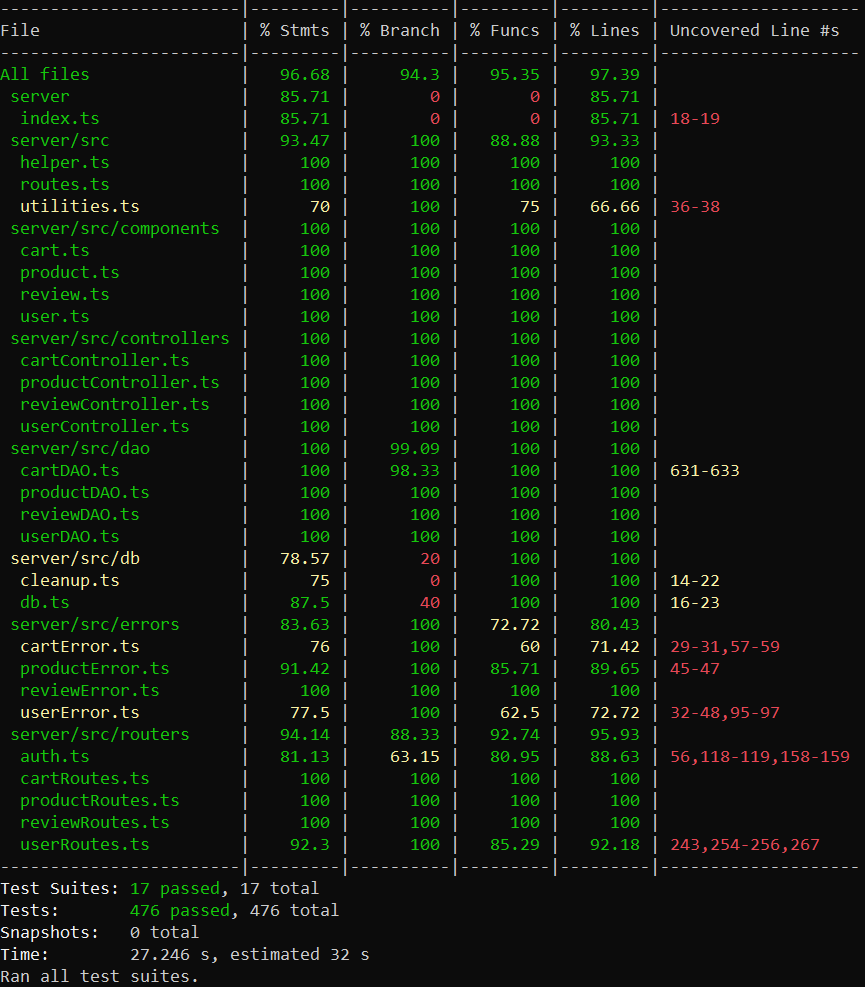
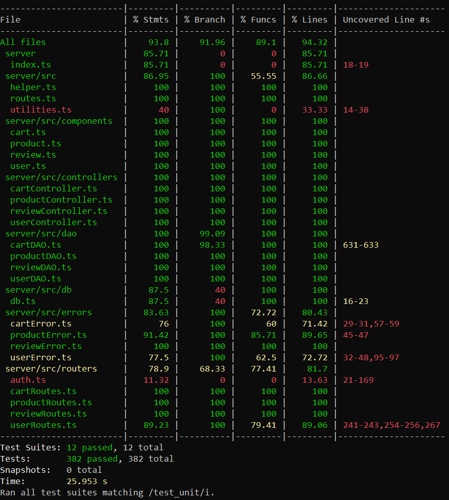
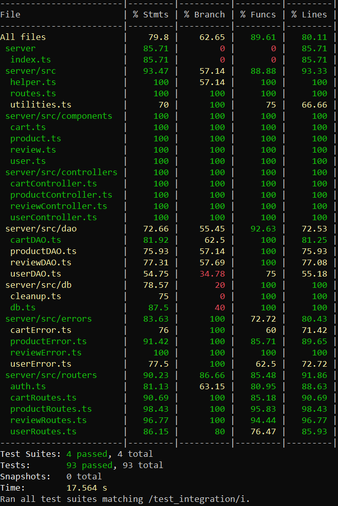

# Test Report

# Contents

- [Test Report](#test-report)
- [Contents](#contents)
- [Dependency graph](#dependency-graph)
- [Integration approach](#integration-approach)
- [Tests](#tests)
- [Coverage](#coverage)
  - [Coverage of FR](#coverage-of-fr)
  - [Coverage white box](#coverage-white-box)

# Dependency graph

# Integration approach

# Integration approach

The integration testing for the EzElectronics application employed a mixed approach, utilizing both top-down and bottom-up techniques to guarantee thorough coverage and effective module interaction testing. The integration sequence proceeded as follows:

### - Step 1: Unit Testing
> Each unit was tested independently to verify the functionality of individual components. This involved testing all methods in all components. In this phase it was used a mixed approach: from DAO to Routes and from Routes to DAO.
> 
> For each test we started from correct cases going top to all the reject cases. 

> Assuming authenticator implementation has a correct behavior.

### - Step 2: Integration Testing
> The final phase of testing involved integrating the API endpoints:

> Testing all RESTful endpoints: Verified the functionality of GET, POST, PATCH, and DELETE requests for every components (user, cart, review and product), ensuring proper interaction with backend controllers and the database.

> Moreover it was covered also security and error handling: 
> Ensured the API correctly handles various scenarios, such as unauthorized access, resource not found and possible errors in body and route parameters.

This combined integration strategy was instrumental in identifying interface issues and guaranteeing that the components function cohesively as a unified system.

# Tests

## Unit tests

### Cart tests

#### Cart routes tests
|       Test case name        |  Object(s) tested  | Test level |     Technique used     |
| :-------------------------  | :----------------  | :--------  | :--------------------  |
| It should return 200 success code |    GET /carts    |    Unit    |  WB/statement coverage |
| It should fail if the user is not logged |    GET /carts    |    Unit    |  WB/statement coverage |
| It should fail if the user is not a customer |    GET /carts    |    Unit    |  WB/statement coverage |
| It should throw an error if the controller returns an error |    GET /carts    |    Unit    |  WB/statement coverage |
| It should return a 200 success code |    POST /carts   |    Unit    |  WB/statement coverage |
| It should fail if the body of the request (model) is not valid |    POST /carts   |    Unit    |  WB/statement coverage |
| It should fail if the user is not logged |    POST /carts   |    Unit    |  WB/statement coverage |
| It should fail if the user is not a customer |    POST /carts   |    Unit    |  WB/statement coverage |
| It should throw an error if the controller returns an error |    POST /carts   |    Unit    |  WB/statement coverage |
| It should return a 200 success code |    PATCH /carts  |    Unit    |  WB/statement coverage |
| It should fail if the user is not logged |    PATCH /carts  |    Unit    |  WB/statement coverage |
| It should fail if the user is not a customer |    PATCH /carts  |    Unit    |  WB/statement coverage |
| It should throw an error if the controller returns an error |    PATCH /carts  |    Unit    |  WB/statement coverage |
| It should return a 200 success code | GET /carts/history |    Unit    |  WB/statement coverage |
| It should fail if the user is not logged | GET /carts/history |    Unit    |  WB/statement coverage |
| It should fail if the user is not a customer | GET /carts/history |    Unit    |  WB/statement coverage |
| It should throw an error if the controller returns an error | GET /carts/history |    Unit    |  WB/statement coverage |
| It should return a 200 success code | DELETE /carts/:model |    Unit    |  WB/statement coverage |
| It should fail if the user is not logged | DELETE /carts/:model |    Unit    |  WB/statement coverage |
| It should fail if the user is not a customer | DELETE /carts/:model |    Unit    |  WB/statement coverage |
| It should throw an error if the controller returns an error | DELETE /carts/:model |    Unit    |  WB/statement coverage |
| It should return a 200 success code | DELETE /carts/current |    Unit    |  WB/statement coverage |
| It should fail if the user is not logged | DELETE /carts/current |    Unit    |  WB/statement coverage |
| It should fail if the user is not a customer | DELETE /carts/current |    Unit    |  WB/statement coverage |
| It should throw an error if the controller returns an error | DELETE /carts/current |    Unit    |  WB/statement coverage |
| It should return a 200 success code |    DELETE /carts   |    Unit    |  WB/statement coverage |
| It should fail if the user is not logged |    DELETE /carts   |    Unit    |  WB/statement coverage |
| It should fail if the user is not a admin or a manager |    DELETE /carts   |    Unit    |  WB/statement coverage |
| It should throw an error if the controller returns an error |    DELETE /carts   |    Unit    |  WB/statement coverage |
| It should return a 200 success code | GET /carts/all |    Unit    |  WB/statement coverage |
| It should fail if the user is not logged | GET /carts/all |    Unit    |  WB/statement coverage |
| It should fail if the user is not a admin or a manager | GET /carts/all |    Unit    |  WB/statement coverage |
| It should throw an error if the controller returns an error | GET /carts/all |    Unit    |  WB/statement coverage |

#### Cart controller tests
|       Test case name        |  Object(s) tested  | Test level |     Technique used     |
| :-------------------------  | :----------------  | :--------  | :--------------------  |
| It should return true                                                                                   | addToCart             | Unit       | WB/statement coverage    |
| It should return the user cart                                                                          | getCart               | Unit       | WB/statement coverage    |
| Should reject on a generic error                                                                        | getCart               | Unit       | WB/statement coverage    |
| It should return true                                                                                   | checkoutCart          | Unit       | WB/statement coverage    |
| It should return the user carts                                                                         | getCustomerCarts      | Unit       | WB/statement coverage    |
| It should return true                                                                                   | removeProductFromCart | Unit       | WB/statement coverage    |
| It should return true                                                                                   | clearCart             | Unit       | WB/statement coverage    |
| It should return true                                                                                   | deleteAllCarts        | Unit       | WB/statement coverage    |
| It should return an array of carts                                                                      | getAllCarts           | Unit       | WB/statement coverage    |

#### Cart DAO tests
|       Test case name        |  Object(s) tested  | Test level |     Technique used     |
| :-------------------------  | :----------------  | :--------  | :--------------------  |
| Should return an unpaid empty cart (cart not already present in the DB)         | getCurrentCart   | Unit       | WB/statement coverage |
| Should return an unpaid empty cart (cart already present in the DB)             | getCurrentCart   | Unit       | WB/statement coverage |
| Should return the current unpaid cart (not empty)                               | getCurrentCart   | Unit       | WB/statement coverage |
| Should reject if the first query (get unpaid cart) throws an error              | getCurrentCart   | Unit       | WB/statement coverage |
| Should reject if the second query (get products of the unpaid cart) throws an error | getCurrentCart   | Unit   | WB/statement coverage |
| Should reject if the third query (get products info of the unpaid cart) throws an error | getCurrentCart   | Unit       | WB/statement coverage |
| It should reject if an generic error is thrown in the try block                 | getCurrentCart   | Unit       | WB/statement coverage |
| It should return true if the product is added to the current cart (cart and product already present in the DB with quantity >= 1 and paid = 0) | addToCurrentCart | Unit       | WB/statement coverage |
| It should return true if the product is added to the current cart (cart already present in the DB but product not present and paid = 0) | addToCurrentCart | Unit       | WB/statement coverage |
| It should return true if the product is added to the current cart (cart not paid not present in the DB) | addToCurrentCart | Unit       | WB/statement coverage |
| Should reject if the fourth update query of the method fails                    | addToCurrentCart | Unit       | WB/statement coverage |
| Should reject if the sixth select query of the method fails                     | addToCurrentCart | Unit       | WB/statement coverage |
| Should reject if the third update query of the method fails                     | addToCurrentCart | Unit       | WB/statement coverage |
| Should reject if the second update query of the method fails                    | addToCurrentCart | Unit       | WB/statement coverage |
| Should reject if the fifth select query of the method fails                     | addToCurrentCart | Unit       | WB/statement coverage |
| Should reject if the third insert query of the method fails                     | addToCurrentCart | Unit       | WB/statement coverage |
| Should reject if the fourth select query of the method fails                    | addToCurrentCart | Unit       | WB/statement coverage |
| Should reject if the first update query of the method fails                     | addToCurrentCart | Unit       | WB/statement coverage |
| Should reject if the third select query of the method fails                     | addToCurrentCart | Unit       | WB/statement coverage |
| Should reject if the second insert query of the method fails                    | addToCurrentCart | Unit       | WB/statement coverage |
| Should reject if the first insert query of the method fails                     | addToCurrentCart | Unit       | WB/statement coverage |
| Should reject if the second select query of the method fails                    | addToCurrentCart | Unit       | WB/statement coverage |
| Should reject if the first select query of the method fails                     | addToCurrentCart | Unit       | WB/statement coverage |
| Should reject if the product exist but the quantity is 0                        | addToCurrentCart | Unit       | WB/statement coverage |
| Should reject if the product does not exist                                     | addToCurrentCart | Unit       | WB/statement coverage |
| It should reject if an generic error is thrown in the try block                 | addToCurrentCart | Unit       | WB/statement coverage |
| Should resolve true if the cart checkout is successful                          | checkoutCart     | Unit       | WB/statement coverage |
| Should reject if the first query (get unpaid cart) throws an error              | checkoutCart     | Unit       | WB/statement coverage |
| Should reject if the first query (get unpaid cart) does not find an unpaid cart | checkoutCart     | Unit       | WB/statement coverage |
| Should reject if the second query (get products of the unpaid cart) throws an error | checkoutCart | Unit       | WB/statement coverage |
| Should reject if the second query (get products of the unpaid cart) finds an empty cart | checkoutCart | Unit       | WB/statement coverage |
| Should reject if the third query (get the disponibility of the products) throws an error | checkoutCart | Unit       | WB/statement coverage |
| Should reject if the third query (get the disponibility of the products) finds a product with disponibility 0 | checkoutCart | Unit       | WB/statement coverage |
| Should reject if the third query (get the disponibility of the products) finds a product with disponibility < quantity in the cart | checkoutCart | Unit       | WB/statement coverage |
| Should reject if the fourth query (update the avilability of the products) throws an error | checkoutCart | Unit       | WB/statement coverage |
| Should reject if the fifth query (pay the cart) throws an error                                         | checkoutCart     | Unit       | WB/statement coverage    |
| It should reject if an generic error is thrown in the try block                 | checkoutCart     | Unit       | WB/statement coverage |
| Should resolve an empty array of carts if the user has no paid carts in the history                     | getCustomerCarts | Unit       | WB/statement coverage    |
| Should resolve an array of carts with products in different categories                                   | getCustomerCarts | Unit       | WB/statement coverage    |
| Should reject if there is an error with the first select query of the method                            | getCustomerCarts | Unit       | WB/statement coverage    |
| Should reject if there is an error with the second select query of the method                           | getCustomerCarts | Unit       | WB/statement coverage    |
| It should reject if an generic error is thrown in the try block                 | getCustomerCarts | Unit       | WB/statement coverage |
| Should resolve true if the product is removed successfully and there's only one instance in the cart    | removeProductFromCart | Unit | WB/statement coverage    |
| Should resolve true if the product is removed successfully and there are multiple instances in the cart | removeProductFromCart | Unit | WB/statement coverage    |
| Should reject if there's an error in the first select query of the method                               | removeProductFromCart | Unit | WB/statement coverage    |
| Should reject if product not found                                                                      | removeProductFromCart | Unit | WB/statement coverage    |
| Should reject if there's an error in the second select query of the method                              | removeProductFromCart | Unit | WB/statement coverage    |
| Should reject if no unpaid cart is found for the user                                                   | removeProductFromCart | Unit | WB/statement coverage    |
| Should reject if there's an error in the third select query of the method                               | removeProductFromCart | Unit | WB/statement coverage    |
| Should reject if the cart is empty                                                                      | removeProductFromCart | Unit | WB/statement coverage    |
| Should reject if there's an error in the fourth select query of the method                              | removeProductFromCart | Unit | WB/statement coverage    |
| Should reject if there's an error in the fourth select query of the method and there are no products in the cart | removeProductFromCart | Unit | WB/statement coverage    |
| Should reject if there's an error in the first delete query of the method                                | removeProductFromCart  | Unit       | WB/statement coverage    |
| Should reject if there's an error in the first update query of the method                                | removeProductFromCart  | Unit       | WB/statement coverage    |
| Should reject if there's an error in the second update query of the method                               | removeProductFromCart  | Unit       | WB/statement coverage    |
| Should reject if there's an error in the third update query of the method                                | removeProductFromCart  | Unit       | WB/statement coverage    |
| It should reject if an generic error is thrown in the try block                 | removeProductFromCart  | Unit       | WB/statement coverage |
| Should resolve true if the cart is successfully cleared                                                  | clearCart              | Unit       | WB/statement coverage    |
| Should reject if the first query (get unpaid cart) throws an error                                       | clearCart              | Unit       | WB/statement coverage    |
| Should reject if the first query (get unpaid cart) does not find an unpaid cart                           | clearCart              | Unit       | WB/statement coverage    |
| Should reject if the second query (clear cart) throws an error                                           | clearCart              | Unit       | WB/statement coverage    |
| Should reject if the third query (set the total of the unpaid cart to 0) throws an error                  | clearCart              | Unit       | WB/statement coverage    |
| It should reject if an generic error is thrown in the try block                 | clearCart              | Unit       | WB/statement coverage |
| Should return true if all the carts are deleted                                                          | deleteAllCarts         | Unit       | WB/statement coverage    |
| Should reject if the first query (delete all the products of all the carts) throws an error               | deleteAllCarts         | Unit       | WB/statement coverage    |
| Should reject if the second query (delete all the carts) throws an error                                 | deleteAllCarts         | Unit       | WB/statement coverage    |
| It should reject if an generic error is thrown in the try block                 | deleteAllCarts         | Unit       | WB/statement coverage |
| Should resolve in an empty array of carts if there are no carts                                           | getAllCarts            | Unit       | WB/statement coverage    |
| Should resolve in an array of carts                                                                      | getAllCarts            | Unit       | WB/statement coverage    |
| Should reject if the first query (get all the carts) throws an error                                     | getAllCarts            | Unit       | WB/statement coverage    |
| Should reject if the second query (get products of the unpaid cart) throws an error                       | getAllCarts            | Unit       | WB/statement coverage    |
| It should reject if an generic error is thrown in the try block                 | getAllCarts            | Unit       | WB/statement coverage |

### Review tests

#### Review routes tests
|       Test case name       |        Object(s) tested        | Test level |     Technique used     |
|:-------------------------- |:------------------------------ |:---------- |:---------------------- |
| It should return a 200 success code | POST ezelectronics/reviews/:model |   Unit    | WB/statement coverage |
| It should fail if the route parameter (model) is not valid | POST ezelectronics/reviews/:model |   Unit    | WB/statement coverage |
| It should fail if the body of the request (score) is not valid | POST ezelectronics/reviews/:model |   Unit    | WB/statement coverage |
| It should fail if the body of the request (comment) is not valid | POST ezelectronics/reviews/:model |   Unit    | WB/statement coverage |
| It should fail if the body of the request (score, comment) is not valid | POST ezelectronics/reviews/:model |   Unit    | WB/statement coverage |
| It should fail if the user is not logged | POST ezelectronics/reviews/:model |   Unit    | WB/statement coverage |
| It should fail if the user is not a customer | POST ezelectronics/reviews/:model |   Unit    | WB/statement coverage |
| It should throw an error if the controller returns an error | POST ezelectronics/reviews/:model |   Unit    | WB/statement coverage |
| It should return an array of ProductReview objects | GET ezelectronics/reviews/:model |   Unit    | WB/statement coverage |
| It should fail if the user is not logged | GET ezelectronics/reviews/:model |   Unit    | WB/statement coverage |
| It should throw an error if the controller returns an error | GET ezelectronics/reviews/:model |   Unit    | WB/statement coverage |
| It should return a 200 success code | DELETE ezelectronics/reviews/:model |   Unit    | WB/statement coverage |
| It should fail if the user is not logged | DELETE ezelectronics/reviews/:model |   Unit    | WB/statement coverage |
| It should fail if the user is not a customer | DELETE ezelectronics/reviews/:model |   Unit    | WB/statement coverage |
| It should throw an error if the controller returns an error | DELETE ezelectronics/reviews/:model |   Unit    | WB/statement coverage |
| It should return a 200 success code | DELETE ezelectronics/reviews/:model/all |   Unit    | WB/statement coverage |
| It should fail if the user is not logged | DELETE ezelectronics/reviews/:model/all |   Unit    | WB/statement coverage |
| It should fail if the user is not an Admin or a Manager | DELETE ezelectronics/reviews/:model/all |   Unit    | WB/statement coverage |
| It should throw an error if the controller returns an error | DELETE ezelectronics/reviews/:model/all |   Unit    | WB/statement coverage |
| It should return a 200 success code | DELETE ezelectronics/reviews |   Unit    | WB/statement coverage |
| It should fail if the user is not logged | DELETE ezelectronics/reviews |   Unit    | WB/statement coverage |
| It should fail if the user is not an Admin or a Manager | DELETE ezelectronics/reviews |   Unit    | WB/statement coverage |
| It should throw an error if the controller returns an error | DELETE ezelectronics/reviews |   Unit    | WB/statement coverage |

#### Review controller tests
|       Test case name       |        Object(s) tested        | Test level |     Technique used     |
|:-------------------------- |:------------------------------ |:---------- |:---------------------- |
| It should return void | addReview Method | Unit | WB/statement coverage |
| It should return an array of ProductReview | getProductReviews Method | Unit | WB/statement coverage |
| It should return void | deleteReview Method | Unit | WB/statement coverage |
| It should return void | deleteReviewsOfProduct Method | Unit | WB/statement coverage |
| It should return void | deleteAllReviews Method | Unit | WB/statement coverage |

#### Review DAO tests
|       Test case name       |        Object(s) tested        | Test level |     Technique used     |
|:-------------------------- |:------------------------------ |:---------- |:---------------------- |
| It should resolve with void if everything goes well | addReview | Unit | WB/statement coverage |
| It should throw DB Error (db.run) | addReview | Unit | WB/statement coverage |
| It should throw an ExistingReviewError if review already exists | addReview | Unit | WB/statement coverage |
| It should throw DB Error (second db.get) | addReview | Unit | WB/statement coverage |
| It should throw a ProductNotFoundError if product does not exist | addReview | Unit | WB/statement coverage |
| It should throw DB Error (first db.get) | addReview | Unit | WB/statement coverage |
| It should throw an error if thrown in the try block | addReview | Unit | WB/statement coverage |
| It should resolve with an array of ProductReview if everything goes well | getProductReviews | Unit | WB/statement coverage |
| It should throw a NoReviewProductError if there are no reviews for the product | getProductReviews | Unit | WB/statement coverage |
| It should throw DB Error (db.all) | getProductReviews | Unit | WB/statement coverage |
| It should throw a ProductNotFoundError if product does not exist | getProductReviews | Unit | WB/statement coverage |
| It should throw DB Error (db.get) | getProductReviews | Unit | WB/statement coverage |
| It should throw an error if thrown in the try block | getProductReviews | Unit | WB/statement coverage |
| It should resolve with void if everything goes well | deleteReview | Unit | WB/statement coverage |
| It should throw DB Error (db.run) | deleteReview | Unit | WB/statement coverage |
| It should throw a NoReviewProductError if there are no reviews for the product | deleteReview | Unit | WB/statement coverage |
| It should throw DB Error (second db.get) | deleteReview | Unit | WB/statement coverage |
| It should throw a ProductNotFoundError if product does not exist | deleteReview | Unit | WB/statement coverage |
| It should throw DB Error (first db.get) | deleteReview | Unit | WB/statement coverage |
| It should throw an error if thrown in the try block | deleteReview | Unit | WB/statement coverage |
| It should resolve with void if everything goes well | deleteReviewsOfProduct | Unit | WB/statement coverage |
| It should throw DB Error (db.run) | deleteReviewsOfProduct | Unit | WB/statement coverage |
| It should throw a ProductNotFoundError if product does not exist | deleteReviewsOfProduct | Unit | WB/statement coverage |
| It should throw DB Error (db.get) | deleteReviewsOfProduct | Unit | WB/statement coverage |
| It should throw an error if thrown in the try block | deleteReviewsOfProduct | Unit | WB/statement coverage |
| It should resolve with void if everything goes well | deleteAllReviews | Unit | WB/statement coverage |
| It should throw DB Error (db.run) | deleteAllReviews | Unit | WB/statement coverage |
| It should throw an error if thrown in the try block | deleteAllReviews | Unit | WB/statement coverage |

### Product tests

#### Product routes tests
|       Test case name       |        Object(s) tested        | Test level |     Technique used     |
|:-------------------------- |:------------------------------ |:---------- |:---------------------- |
| It should return a 200 success code | POST /products | Unit | WB/statement coverage |
| It should return a 400 error code if arrivalDate is after the current date | POST /products | Unit | WB/statement coverage |
| It should fail if the body of the request (model) is not valid | POST /products | Unit | WB/statement coverage |
| It should fail if the body of the request (category) is not valid | POST /products | Unit | WB/statement coverage |
| It should fail if the body of the request (quantity) is not valid | POST /products | Unit | WB/statement coverage |
| It should fail if the body of the request (details) is not valid | POST /products | Unit | WB/statement coverage |
| It should fail if the body of the request (sellingPrice) is not valid | POST /products | Unit | WB/statement coverage |
| It should fail if the body of the request (arrivalDate) is not valid | POST /products | Unit | WB/statement coverage |
| It should return a 200 success code if the product does not have arrivalDate | POST /products | Unit | WB/statement coverage |
| It should fail if the user is not logged | POST /products | Unit | WB/statement coverage |
| It should fail if the user is not Admin or Manager | POST /products | Unit | WB/statement coverage |
| It should throw an error if the controller returns an error | POST /products | Unit | WB/statement coverage |
| It should return a 200 success code | PATCH /products/:model | Unit | WB/statement coverage |
| It should return a 200 success code without changeDate | PATCH /products/:model | Unit | WB/statement coverage |
| It should fail if the body of the request (quantity) is not valid | PATCH /products/:model | Unit | WB/statement coverage |
| It should fail if the body of the request (changeDate) is not valid | PATCH /products/:model | Unit | WB/statement coverage |
| It should return a 400 error code if changeDate is after current date | PATCH /products/:model | Unit | WB/statement coverage |
| It should fail if the user is not logged | PATCH /products/:model | Unit | WB/statement coverage |
| It should fail if the user is not Admin or Manager | PATCH /products/:model | Unit | WB/statement coverage |
| It should throw an error if the controller returns an error | PATCH /products/:model | Unit | WB/statement coverage |
| It should return a 200 success code | PATCH /products/:model/sell | Unit | WB/statement coverage |
| It should return a 200 success code without sellingDate | PATCH /products/:model/sell | Unit | WB/statement coverage |
| It should fail if the body of the request (quantity) is not valid | PATCH /products/:model/sell | Unit | WB/statement coverage |
| It should fail if the body of the request (sellingDate) is not valid | PATCH /products/:model/sell | Unit | WB/statement coverage |
| It should return a 400 error code if sellingDate is after current date | PATCH /products/:model/sell | Unit | WB/statement coverage |
| It should fail if the user is not logged | PATCH /products/:model/sell | Unit | WB/statement coverage |
| It should fail if the user is not Admin or Manager | PATCH /products/:model/sell | Unit | WB/statement coverage |
| It should throw an error if the controller returns an error | PATCH /products/:model/sell | Unit | WB/statement coverage |
| It should return a 200 success code | GET /products | Unit | WB/statement coverage |
| Test with grouping 'category', it should return a 200 success code | GET /products | Unit | WB/statement coverage |
| Test with grouping 'model', it should return a 200 success code | GET /products | Unit | WB/statement coverage |
| Test with grouping 'model' and both model and category present, it should return a 422 error | GET /products | Unit | WB/statement coverage |
| Test without grouping but with category and model, it should return a 422 error | GET /products | Unit | WB/statement coverage |
| Test with grouping 'category' but without category, it should return a 422 error | GET /products | Unit | WB/statement coverage |
| Test with grouping 'category' and model present, it should return a 422 error | GET /products | Unit | WB/statement coverage |
| Test with grouping 'model' but without model, it should return a 422 error | GET /products | Unit | WB/statement coverage |
| Test with grouping 'model' and category present, it should return a 422 error | GET /products | Unit | WB/statement coverage |
| It should fail if the user is not logged | GET /products | Unit | WB/statement coverage |
| It should fail if the user is not Admin or Manager | GET /products | Unit | WB/statement coverage |
| It should throw an error if the controller returns an error | GET /products | Unit | WB/statement coverage |
| It should return a 200 success code | GET /products/available | Unit | WB/statement coverage |
| Test with grouping 'category', it should return a 200 success code | GET /products/available | Unit | WB/statement coverage |
| Test with grouping 'model', it should return a 200 success code | GET /products/available | Unit | WB/statement coverage |
| Test with grouping 'model' and both model and category present, it should return a 422 error | GET /products/available | Unit | WB/statement coverage |
| Test without grouping but with category and model, it should return a 422 error | GET /products/available | Unit | WB/statement coverage |
| Test with grouping 'category' but without category, it should return a 422 error | GET /products/available | Unit | WB/statement coverage |
| Test with grouping 'category' and model present, it should return a 422 error | GET /products/available | Unit | WB/statement coverage |
| Test with grouping 'model' but without model, it should return a 422 error | GET /products/available | Unit | WB/statement coverage |
| Test with grouping 'model' and category present, it should return a 422 error | GET /products/available | Unit | WB/statement coverage |
| It should fail if the user is not logged | GET /products/available | Unit | WB/statement coverage |
| It should throw an error if the controller returns an error | GET /products/available | Unit | WB/statement coverage |
| It should return a 200 success code | DELETE /products/:model | Unit | WB/statement coverage |
| It should fail if the user is not logged | DELETE /products/:model | Unit | WB/statement coverage |
| It should fail if the user is not Admin or Manager | DELETE /products/:model | Unit | WB/statement coverage |
| It should throw an error if the controller returns an error | DELETE /products/:model | Unit | WB/statement coverage |
| It should return a 200 success code | DELETE /products | Unit | WB/statement coverage |
| It should fail if the user is not logged | DELETE /products | Unit | WB/statement coverage |
| It should fail if the user is not Admin or Manager | DELETE /products | Unit | WB/statement coverage |
| It should throw an error if the controller returns an error | DELETE /products | Unit | WB/statement coverage |

#### Product controller tests
|       Test case name        |  Object(s) tested  | Test level |     Technique used     |
| :-------------------------  | :----------------  | :--------  | :--------------------  |
| It should return void | registerProducts | Unit | WB/statement coverage |
| It should return the new quantity of the product | changeProductQuantity | Unit | WB/statement coverage |
| It should return void | sellProduct | Unit | WB/statement coverage |
| It should return all products when grouping is null | getProducts | Unit | WB/statement coverage |
| It should return products by category when grouping is 'category' | getProducts | Unit | WB/statement coverage |
| It should return product by model when grouping is 'model' | getProducts | Unit | WB/statement coverage |
| It should return all available products when grouping is null | getAvailableProducts | Unit | WB/statement coverage |
| It should return products by category when grouping is 'category' | getAvailableProducts | Unit | WB/statement coverage |
| It should return product by model when grouping is 'model' | getAvailableProducts | Unit | WB/statement coverage |
| It should delete all products | deleteAllProducts | Unit | WB/statement coverage |
| It should delete the product with the specified model | deleteProduct | Unit | WB/statement coverage |

#### Product DAO tests
|       Test case name        |  Object(s) tested  | Test level |     Technique used     |
| :-------------------------  | :----------------  | :--------  | :--------------------  |
| It should return undefined for registering a new product | addNewProduct | Unit | WB/statement coverage |
| It should reject with ProductAlreadyExistsError if the product already exists | addNewProduct | Unit | WB/statement coverage |
| It should throw an error if database fails to get the product | addNewProduct | Unit | WB/statement coverage |
| It should throw an error if database fails to insert the product | addNewProduct | Unit | WB/statement coverage |
| It should throw an error if an unexpected error occurs in the try block | addNewProduct | Unit | WB/statement coverage |
| It should return a new quantity of product | changeProductQuantity | Unit | WB/statement coverage |
| It should return a 404 error if model does not represent a product in the database | changeProductQuantity | Unit | WB/statement coverage |
| It should return a 400 error if changeDate is before arrivalDate | changeProductQuantity | Unit | WB/statement coverage |
| It should throw an error if database fails to return the product | changeProductQuantity | Unit | WB/statement coverage |
| It should throw an error if database fails to update the product quantity | changeProductQuantity | Unit | WB/statement coverage |
| It should throw an error if an unexpected error occurs in the try block | changeProductQuantity | Unit | WB/statement coverage |
| It should return undefined to sell the product | sellProduct | Unit | WB/statement coverage |
| It should return a 404 error if model does not represent a product in the database | sellProduct | Unit | WB/statement coverage |
| It should return a 400 error if sellingDate is before the arrivalDate of the product | sellProduct | Unit | WB/statement coverage |
| It should return a 409 error if available quantity of product is 0 | sellProduct | Unit | WB/statement coverage |
| It should return a 409 error if the product's quantity is lower than the requested quantity | sellProduct | Unit | WB/statement coverage |
| It should throw an error if database fails to return the product | sellProduct | Unit | WB/statement coverage |
| It should throw an error if database fails to update the product quantity | sellProduct | Unit | WB/statement coverage |
| It should throw an error if an unexpected error occurs in the try block | sellProduct | Unit | WB/statement coverage |
| It should return a array of products | getAllProducts | Unit | WB/statement coverage |
| It should return a array of products with quantity > 0 | getAllProducts | Unit | WB/statement coverage |
| It should throw an error if database fails to get the products | getAllProducts | Unit | WB/statement coverage |
| It should throw an error if an unexpected error occurs in the try block | getAllProducts | Unit | WB/statement coverage |
| It should return an array of products of a category specified | getProductsByCategory | Unit | WB/statement coverage |
| It should return an array of products of a category specified with quantity > 0 | getProductsByCategory | Unit | WB/statement coverage |
| It should throw an error if database fails to get the products | getProductsByCategory | Unit | WB/statement coverage |
| It should throw an error if an unexpected error occurs in the try block | getProductsByCategory | Unit | WB/statement coverage |
| It should return an array of products of a model specified | getProductByModel | Unit | WB/statement coverage |
| It should return an array of products of a model specified with quantity > 0 | getProductByModel | Unit | WB/statement coverage |
| It should return a 404 error if model does not represent a product in the database | getProductByModel | Unit | WB/statement coverage |
| It should throw an error if database fails to get the product | getProductByModel | Unit | WB/statement coverage |
| It should throw an error if an unexpected error occurs in the try block | getProductByModel | Unit | WB/statement coverage |
| It should return true for delete product | deleteProduct | Unit | WB/statement coverage |
| It should return a 404 error if model does not represent a product in the database | deleteProduct | Unit | WB/statement coverage |
| It should throw an error if database fails to get the product | deleteProduct | Unit | WB/statement coverage |
| It should throw an error if database fails to delete the product | deleteProduct | Unit | WB/statement coverage |
| It should throw an error if an unexpected error occurs in the try block | deleteProduct | Unit | WB/statement coverage |
| It should return true for delete all products | deleteAllProducts | Unit | WB/statement coverage |
| It should throw an error if database fails to delete all products | deleteAllProducts | Unit | WB/statement coverage |
| It should throw an error if an unexpected error occurs in the try block | deleteAllProducts | Unit | WB/statement coverage |

### User tests

#### User routes tests
|       Test case name       |        Object(s) tested        | Test level |     Technique used     |
|:-------------------------- |:------------------------------ |:---------- |:---------------------- |
| It should return 200 success code                                            | POST /users           | Unit | WB/statement coverage       |
| It should fail if the body parameter (username) is not valid                 | POST /users           | Unit | WB/statement coverage       |
| It should fail if the body parameter (name) is not valid                     | POST /users           | Unit | WB/statement coverage       |
| It should fail if the body parameter (surname) is not valid                  | POST /users           | Unit | WB/statement coverage       |
| It should fail if the body parameter (password) is not valid                 | POST /users           | Unit | WB/statement coverage       |
| It should fail if the body parameter (role) is not valid                     | POST /users           | Unit | WB/statement coverage       |
| It should return 200 and array of users                                      | GET /users            | Unit | WB/statement coverage       |
| It should fail if the user is not logged in                                  | GET /users            | Unit | WB/statement coverage       |
| It should fail if the user is not an admin                                   | GET /users            | Unit | WB/statement coverage       |
| It should return 200 and array of users by role                              | GET /roles/:role      | Unit | WB/statement coverage       |
| It should fail if the role parameter is not valid                            | GET /roles/:role      | Unit | WB/statement coverage       |
| It should fail if the user is not logged in                                  | GET /roles/:role      | Unit | WB/statement coverage       |
| It should fail if the user is not an admin                                   | GET /roles/:role      | Unit | WB/statement coverage       |
| It should return 200 and the user information                                | GET /:username        | Unit | WB/statement coverage       |
| It should fail if the username parameter is not valid                        | GET /:username        | Unit | WB/statement coverage       |
| It should fail if the user is not authenticated                              | GET /:username        | Unit | WB/statement coverage       |
| It should fail if a non-admin user tries to access another user's data       | GET /:username        | Unit | WB/statement coverage       |
| It should return 200 success code                                            | DELETE /:username     | Unit | WB/statement coverage       |
| It should fail if the username parameter is not valid                        | DELETE /:username     | Unit | WB/statement coverage       |
| It should fail if the user is not authenticated                              | DELETE /:username     | Unit | WB/statement coverage       |
| It should fail if a non-admin user tries to delete another user's data       | DELETE /:username     | Unit | WB/statement coverage       |
| It should return 200 success code                                            | DELETE /              | Unit | WB/statement coverage       |
| It should fail if the user is not logged in                                  | DELETE /              | Unit | WB/statement coverage       |
| It should fail if the user is not an admin                                   | DELETE /              | Unit | WB/statement coverage       |
| It should return 200 and the updated user                                    | PATCH /:username      | Unit | WB/statement coverage       |
| It should fail if the username parameter is not valid                        | PATCH /:username      | Unit | WB/statement coverage       |
| It should fail if the body parameter (name) is not valid                     | PATCH /:username      | Unit | WB/statement coverage       |
| It should fail if the body parameter (surname) is not valid                  | PATCH /:username      | Unit | WB/statement coverage       |
| It should fail if the body parameter (address) is not valid                  | PATCH /:username      | Unit | WB/statement coverage       |
| It should fail if the body parameter (birthdate) is not valid                | PATCH /:username      | Unit | WB/statement coverage       |
| It should fail if the birthdate is in the future                             | PATCH /:username      | Unit | WB/statement coverage       |
| It should fail if the user is not authenticated                              | PATCH /:username      | Unit | WB/statement coverage       |
| It should fail if a non-admin user tries to update another user's data       | PATCH /:username      | Unit | WB/statement coverage       |
| It should return 200 success code                                            | POST /auth            | Unit | WB/statement coverage       |
| It should fail if the body parameter (username) is not valid                 | POST /auth            | Unit | WB/statement coverage       |
| It should fail if the body parameter (password) is not valid                 | POST /auth            | Unit | WB/statement coverage       |
| It should return 401 if the username does not exist                          | POST /auth            | Unit | WB/statement coverage       |
| It should return 401 if the password is incorrect                            | POST /auth            | Unit | WB/statement coverage       |
| It should return 200 success code                                            | DELETE /auth/current  | Unit | WB/statement coverage       |
| It should fail if the user is not logged in                                  | DELETE /auth/current  | Unit | WB/statement coverage       |
| It should return 200 and the logged-in user's information                    | GET /auth/current     | Unit | WB/statement coverage       |
| It should fail if the user is not logged in                                  | GET /auth/current     | Unit | WB/statement coverage       |

#### User controller tests
|       Test case name        |  Object(s) tested  | Test level |     Technique used     |
| :-------------------------  | :----------------  | :--------  | :--------------------  |
| It should create a user successfully           | createUser    | Unit       | WB/statement coverage       |
| It should retrieve all users successfully      | getUsers      | Unit       | WB/statement coverage       |
| It should retrieve all users by role successfully | getUsersByRole | Unit   | WB/statement coverage       |
| It should retrieve a user by username successfully | getUserByUsername | Unit | WB/statement coverage       |
| It should delete a user successfully           | deleteUser    | Unit       | WB/statement coverage       |
| It should delete all non-Admin users successfully | deleteAll   | Unit       | WB/statement coverage       |
| It should update user info successfully        | updateUserInfo | Unit      | WB/statement coverage       |

#### User DAO tests
|       Test case name        |  Object(s) tested  | Test level |     Technique used     |
| :-------------------------  | :----------------  | :--------  | :--------------------  |
| It should authenticate user successfully                | getIsUserAuthenticated     | Unit       | WB/statement coverage       |
| It should not authenticate user with wrong password     | getIsUserAuthenticated     | Unit       | WB/statement coverage       |
| It should not authenticate user with non-existent username | getIsUserAuthenticated  | Unit       | WB/statement coverage       |
| It should return false if there is no salt in the database | getIsUserAuthenticated  | Unit       | WB/statement coverage       |
| It should throw DB Error during authentication          | getIsUserAuthenticated     | Unit       | WB/statement coverage       |
| It should throw an error if thrown in try block         | getIsUserAuthenticated     | Unit       | WB/statement coverage       |
| It should create a user successfully                    | createUser                 | Unit       | WB/statement coverage       |
| It should throw DB Error during user creation           | createUser                 | Unit       | WB/statement coverage       |
| It should throw UserAlreadyExistsError if username exists | createUser               | Unit       | WB/statement coverage       |
| It should throw an error if thrown in try block         | createUser                 | Unit       | WB/statement coverage       |
| It should retrieve all users successfully               | getUsers                   | Unit       | WB/statement coverage       |
| It should return empty array if there are no users      | getUsers                   | Unit       | WB/statement coverage       |
| It should throw DB Error during retrieving users        | getUsers                   | Unit       | WB/statement coverage       |
| It should throw an error if thrown in try block         | getUsers                   | Unit       | WB/statement coverage       |
| It should retrieve users by role successfully           | getUsersByRole             | Unit       | WB/statement coverage       |
| It should return empty array if no users with specified role | getUsersByRole         | Unit       | WB/statement coverage       |
| It should throw DB Error during retrieving users by role | getUsersByRole           | Unit       | WB/statement coverage       |
| It should throw an error if thrown in try block         | getUsersByRole             | Unit       | WB/statement coverage       |
| It should retrieve user by username successfully        | getUserByUsername          | Unit       | WB/statement coverage       |
| It should throw UserNotFoundError if user doesn't exist | getUserByUsername          | Unit       | WB/statement coverage       |
| It should throw DB Error during retrieving user by username | getUserByUsername       | Unit       | WB/statement coverage       |
| It should throw an error if thrown in try block         | getUserByUsername          | Unit       | WB/statement coverage       |
| It should delete user successfully with carts           | deleteUser                 | Unit       | WB/statement coverage       |
| It should delete user successfully without carts        | deleteUser                 | Unit       | WB/statement coverage       |
| It should throw DB Error during user deletion (sixth db.run) | deleteUser              | Unit       | WB/statement coverage       |
| It should throw DB Error during user deletion (fifth db.run) | deleteUser              | Unit       | WB/statement coverage       |
| It should throw DB Error during user deletion (fourth db.run) | deleteUser             | Unit       | WB/statement coverage       |
| It should throw DB Error during user deletion (third db.run) | deleteUser              | Unit       | WB/statement coverage       |
| It should throw DB Error during user deletion (second db.run) | deleteUser             | Unit       | WB/statement coverage       |
| It should throw DB Error (first db.run)                  | deleteUser      | Unit       | WB/statement coverage |
| It should throw DB Error (db.all)                        | deleteUser      | Unit       | WB/statement coverage |
| It should throw an UserIsAdminError if the user is Admin | deleteUser      | Unit       | WB/statement coverage |
| It should throw an UserNotFoundError if user doesn't exist| deleteUser     | Unit       | WB/statement coverage |
| It should throw DB Error (db.get)                        | deleteUser      | Unit       | WB/statement coverage |
| It should throw an error if throw in the try block        | deleteUser      | Unit       | WB/statement coverage |
| It should resolve with true if users have carts to delete | deleteAll       | Unit       | WB/statement coverage |
| It should resolve with true if users have no carts        | deleteAll       | Unit       | WB/statement coverage |
| It should throw DB Error (sixth db.run)                  | deleteAll       | Unit       | WB/statement coverage |
| It should throw DB Error (fifth db.run)                  | deleteAll       | Unit       | WB/statement coverage |
| It should throw DB Error (forth db.run)                  | deleteAll       | Unit       | WB/statement coverage |
| It should throw DB Error (third db.run)                  | deleteAll       | Unit       | WB/statement coverage |
| It should throw DB Error (second db.run)                 | deleteAll       | Unit       | WB/statement coverage |
| It should throw DB Error (first db.run)                  | deleteAll       | Unit       | WB/statement coverage |
| It should throw DB Error (second db.all)                 | deleteAll       | Unit       | WB/statement coverage |
| It should resolve with true if no non-Admin users to delete| deleteAll     | Unit       | WB/statement coverage |
| It should throw DB Error (first db.all)                  | deleteAll       | Unit       | WB/statement coverage |
| It should throw an error if throw in the try block        | deleteAll      | Unit       | WB/statement coverage |
| It should resolve with an user object if everything goes well| updateUserInfo| Unit       | WB/statement coverage |
| It should throw DB Error (second db.get)                 | updateUserInfo | Unit       | WB/statement coverage |
| It should throw DB Error (db.run)                        | updateUserInfo | Unit       | WB/statement coverage |
| It should throw an UnauthorizedUserError if updating an Admin| updateUserInfo| Unit       | WB/statement coverage |
| It should throw an UserNotAdminError if updating an Admin| updateUserInfo | Unit       | WB/statement coverage |
| It should throw an UserNotFoundError if user doesn't exist| updateUserInfo| Unit       | WB/statement coverage |
| It should throw DB Error (first db.get)                  | updateUserInfo | Unit       | WB/statement coverage |
| It should throw an error if throw in the try block        | updateUserInfo| Unit       | WB/statement coverage |

## Integration tests

### Cart tests
|       Test case name        |  Object(s) tested  | Test level |     Technique used     |
| :-------------------------  | :----------------  | :--------  | :--------------------  |
| Should return the unpaid empty cart (cart not already present in the DB)                                | GET /carts            | Integration| Black-Box                |
| Should return the unpaid empty cart (cart already present in the DB)                                     | GET /carts            | Integration| Black-Box                |
| Should return the unpaid cart (not empty)                                                               | GET /carts            | Integration| Black-Box                |
| Should add a product to the cart (product already in the cart)                                            | POST /carts           | Integration| Black-Box                |
| Should add a product to the cart (product not in the cart)                                                | POST /carts           | Integration| Black-Box                |
| Should add a product to the cart (cart not already present in the DB)                                      | POST /carts           | Integration| Black-Box                |
| Should return an error because the product does not exist                                                | POST /carts           | Integration| Black-Box                |
| Should return an error because the product quantity is 0                                                 | POST /carts           | Integration| Black-Box                |
| Should checkout the cart and return an empty object                                                      | PATCH /carts          | Integration| Black-Box                |
| Should return an error because the cart unpaid does not exist                                             | PATCH /carts          | Integration| Black-Box                |
| Should return an error because the cart is empty                                                         | PATCH /carts          | Integration| Black-Box                |
| Should return an error because the product quantity in stock is 0                                          | PATCH /carts          | Integration| Black-Box                |
| Should return an array with all the paid carts                                                           | GET /carts/history    | Integration| Black-Box                |
| Should return an empty array of cart (no paid carts)                                                      | GET /carts/history    | Integration| Black-Box                |
| Should remove the product from the cart (only one unit)                                                   | DELETE /carts/products| Integration| Black-Box                |
| Should remove the product from the cart (more than one unit)                                              | DELETE /carts/products| Integration| Black-Box                |
| Should return an error because the product is not in stock                                                | DELETE /carts/products| Integration| Black-Box                |
| Should return an error because does not exist an unpaid cart                                              | DELETE /carts/products| Integration| Black-Box                |
| Should return an error because the unpaid cart is empty                                                   | DELETE /carts/products| Integration| Black-Box                |
| Should return an error because the product is not in the cart                                             | DELETE /carts/products| Integration| Black-Box                |
| Should delete the product from the cart                                                                 | DELETE /carts/current | Integration| Black-Box                |
| Should return an error because does not exist an unpaid cart                                              | DELETE /carts/current | Integration| Black-Box                |
| Should delete all the carts                                                                             | DELETE /carts          | Integration| Black-Box                |
| Should return an array empty because there are no carts                                                   | GET /carts/all        | Integration| Black-Box                |
| Should return an array with all the carts                                                                | GET /carts/all        | Integration| Black-Box                |

### Review tests
|       Test case name        |  Object(s) tested  | Test level |     Technique used     |
| :-------------------------  | :----------------  | :--------  | :--------------------  |
| It should return a 200 success code and create a new review | POST reviews/:model | Integration | Black-Box |
| It should return a 422 error code if at least one request body parameter is empty/missing or invalid | POST reviews/:model | Integration | Black-Box |
| It should return a 401 error code if the user is not logged | POST reviews/:model | Integration | Black-Box |
| It should return a 401 error code if the user is not a Customer | POST reviews/:model | Integration | Black-Box |
| It should return a 404 error code if model does not represent an existing product in the database | POST reviews/:model | Integration | Black-Box |
| It should return a 409 error code if there is already an existing review for the product made by the customer | POST reviews/:model | Integration | Black-Box |
| It should return a 200 success code if everything goes well (only one review for the product) | GET reviews/:model | Integration | Black-Box |
| It should return a 200 success code if everything goes well (more reviews for the product) | GET reviews/:model | Integration | Black-Box |
| It should return a 401 error code if the user is not logged | GET reviews/:model | Integration | Black-Box |
| It should return a 404 error code if the product specified does not exist | GET reviews/:model | Integration | Black-Box |
| It should return an empty array if the product exists but there are no reviews for it | GET reviews/:model | Integration | Black-Box |
| It should return a 200 success code if everything goes well | DELETE reviews/:model | Integration | Black-Box |
| It should return a 401 error code if the user is not logged | DELETE reviews/:model | Integration | Black-Box |
| It should return a 401 error code if the user is not a Customer | DELETE reviews/:model | Integration | Black-Box |
| It should return a 404 error code if the product specified does not exist | DELETE reviews/:model | Integration | Black-Box |
| It should return a 404 error code if there are no reviews for the product made by the customer | DELETE reviews/:model | Integration | Black-Box |
| It should return a 200 success code if everything goes well | DELETE reviews/:model/all | Integration | Black-Box |
| It should return a 401 error code if the user is not logged | DELETE reviews/:model/all | Integration | Black-Box |
| It should return a 401 error code if the user is not an Admin or a Customer | DELETE reviews/:model/all | Integration | Black-Box |
| It should return a 404 error code if the product specified does not exist | DELETE reviews/:model/all | Integration | Black-Box |
| It should return a 200 success code if everything goes well | DELETE reviews | Integration | Black-Box |
| It should return a 401 error code if the user is not logged | DELETE reviews | Integration | Black-Box |
| It should return a 401 error code if the user is not an Admin or a Customer | DELETE reviews | Integration | Black-Box |

### Product tests
|       Test case name        |  Object(s) tested  | Test level |     Technique used     |
| :-------------------------  | :----------------  | :--------  | :--------------------  |
| It should return a 200 success code and register a new product                  | POST /products   | Integration | Black-Box       |
| It should return a 200 success code and register a new product without arrivalDate | POST /products   | Integration | Black-Box       |
| It should return a 400 error if arrivalDate is after the current date          | POST /products   | Integration | Black-Box       |
| It should return a 409 if model represents an already existing set of products | POST /products   | Integration | Black-Box       |
| It should return a 200 success code if increases the available quantity of a set of products | PATCH /products/:model | Integration | Black-Box       |
| It should return a 200 success code if increases the available quantity of a set of products without changeDate | PATCH /products/:model | Integration | Black-Box       |
| It should return a 404 error if model does not represent a product in the database, a 400 error if changeDate is after the current date, a 400 error if changeDate is before the product's arrivalDate | PATCH /products/:model | Integration | Black-Box       |
| It should return a 200 success code if sell the product                        | PATCH /products/:model/sell | Integration | Black-Box       |
| It should return a 200 success code if sell the product and sellingDate is null or undefined | PATCH /products/:model/sell | Integration | Black-Box       |
| It should return a 404 error if model does not represent a product in the database, a 400 error if sellingDate is after the current date, a 400 error if sellingDate is before the product's arrivalDate | PATCH /products/:model/sell | Integration | Black-Box       |
| It should return a 409 error if model represents a product whose available quantity is 0 and if the available quantity of model is lower than the requested quantity | PATCH /products/:model/sell | Integration | Black-Box       |
| It should return a 200 success code if return all products                     | GET /products    | Integration | Black-Box       |
| It should return a 422 error if grouping is null and any of category or model is not null, It should return a 422 error if grouping is category and category is null OR model is not null, It should return a 422 error if grouping is model and model is null OR category is not null, It should return a 404 error if model does not represent a product in the database (only when grouping is model) | GET /products    | Integration | Black-Box       |
| It should return a 200 success code if return all products available           | GET /products/available | Integration | Black-Box       |
| It should return a 422 error if grouping is null and any of category or model is not null, It should return a 422 error if grouping is category and category is null OR model is not null, It should return a 422 error if grouping is model and model is null OR category is not null, It should return a 404 error if model does not represent a product in the database (only when grouping is model) | GET /products/available | Integration | Black-Box       |
| It should return a 200 success code if delete a product for database           | DELETE /products/:model | Integration | Black-Box       |
| It should return a 404 error code model does not represent a product in the database | DELETE /products/:model | Integration | Black-Box       |
| It should return a 200 success code if delete all products for database        | DELETE /products  | Integration | Black-Box       |

### User tests
|       Test case name        |  Object(s) tested  | Test level |     Technique used     |
| :-------------------------  | :----------------  | :--------  | :--------------------  |
| Should create a new user and return an empty body              | POST /ezelectronics/users | Integration  | Black-Box               |
| Should return an error if the username already exists          | POST /ezelectronics/users | Integration  | Black-Box               |
| Should return an array of users                               | GET /ezelectronics/users  | Integration  | Black-Box               |
| Should return an error if the role param is not customer, admin or manager | GET /ezelectronics/users  | Integration  | Black-Box               |
| Should return an error if the user is not logged in            | GET /ezelectronics/users | Integration  | Black-Box               |
| Should return an error if the user is not an admin             | GET /ezelectronics/users | Integration  | Black-Box               |
| Should return an array of users with the specified role       | GET /ezelectronics/users/roles/:role | Integration  | Black-Box               |
| Should return an empty array if there are no users with the specified role | GET /ezelectronics/users/roles/:role | Integration  | Black-Box               |
| Should return an error if the role param is not customer, admin or manager | GET /ezelectronics/users/roles/:role | Integration  | Black-Box               |
| Should return an error if the user is not logged in           | GET /ezelectronics/users/roles/:role | Integration | Black-Box               |
| Should return an error if the user is not an admin            | GET /ezelectronics/users/roles/:role | Integration | Black-Box               |
| Should return the user with the specified username            | GET /ezelectronics/users/:role | Integration  | Black-Box               |
| Should return an error if the user is not logged in           | GET /ezelectronics/users/:username | Integration  | Black-Box               |
| Should return an error if the user does not exist             | GET /ezelectronics/users/:username | Integration  | Black-Box               |
| Should return an error if the username of the logged user (not admin) is different from the param username | GET /ezelectronics/users/:username | Integration  | Black-Box               |
| Should delete the user with the specified username            | DELETE /ezelectronics/users/:username | Integration  | Black-Box               |
| Should return an error if the user does not exist             | DELETE /ezelectronics/users/:username | Integration  | Black-Box               |
| Should return an error if the user to delete is an admin and different from the admin logged | DELETE /ezelectronics/users/:username | Integration  | Black-Box               |
| Should return an error if the username of the logged user (not admin) is different from the param username | DELETE /ezelectronics/users/:username | Integration  | Black-Box               |
| Should delete all the users                                   | DELETE /ezelectronics/users | Integration  | Black-Box               |
| Should return an error if the user is not logged in           | DELETE /ezelectronics/users | Integration  | Black-Box               |
| Should return an error if the user is not an admin            | DELETE /ezelectronics/users | Integration  | Black-Box               |
| Should update the user with the specified username            | PATCH /ezelectronics/users/:username | Integration  | Black-Box               |
| Should return an error if the user is not logged in           | PATCH /ezelectronics/users/:username | Integration  | Black-Box               |
| Should return an error if the user does not exist             | PATCH /ezelectronics/users/:username | Integration  | Black-Box               |
| Should return an error if the user to update is a regular user and different from the calling user | PATCH /ezelectronics/users/:username | Integration  | Black-Box               |
| Should return an error if the user to update is an admin and different from the admin logged | PATCH /ezelectronics/users/:username | Integration  | Black-Box               |
| Should return an error if the username of the logged user (not admin) is different from the param username | PATCH /ezelectronics/users/:username | Integration  | Black-Box               |

# Coverage

## Coverage of FR

| Functional Requirement or scenario              | Test(s)                                                                                   |
|:----------------------------------------------- |:----------------------------------------------------------------------------------------- |
| FR1.1: User Login                               | Success: 200 OK, Error: 401 Unauthorized (wrong credentials), 404 Not Found (user not found) |
| FR1.2: User Logout                              | Success: 200 OK, Error: 401 Unauthorized (not logged in)                                  |
| FR1.3: Create a new user account                | Success: 201 Created, Error: 400 Bad Request (invalid input), 409 Conflict (user exists)  |
| FR2.1: Show the list of all users               | Success: 200 OK, Error: 401 Unauthorized (not admin)                                      |
| FR2.2: Show the list of all users with a specific role | Success: 200 OK, Error: 401 Unauthorized (not admin), 404 Not Found (role not found) |
| FR2.3: Show the information of a single user    | Success: 200 OK, Error: 401 Unauthorized (not self or admin), 404 Not Found (user not found) |
| FR2.4: Update the information of a single user  | Success: 200 OK, Error: 400 Bad Request (invalid data), 401 Unauthorized (not self or admin), 404 Not Found (user not found) |
| FR2.5: Delete a single non-Admin user           | Success: 200 OK, Error: 401 Unauthorized (not admin), 404 Not Found (user not found)     |
| FR2.6: Delete all non-Admin users               | Success: 200 OK, Error: 401 Unauthorized (not admin)                                      |
| FR3.1: Register a set of new products           | Success: 201 Created, Error: 400 Bad Request (invalid input), 409 Conflict (product exists) |
| FR3.2: Update the quantity of a product         | Success: 200 OK, Error: 400 Bad Request (invalid date), 404 Not Found (product not found) |
| FR3.3: Sell a product                           | Success: 200 OK, Error: 400 Bad Request (invalid Date), 404 Not Found (product not found), 409 Conflict (insufficient stock) |
| FR3.4: Show the list of all products            | Success: 200 OK, Error: 401 Unauthorized (not admin or manager)                                  |
| FR3.4.1: Show the list of all available products| Success: 200 OK, Error: 401 Unauthorized (not logged in)                                  |
| FR3.5: Show the list of all products with the same category | Success: 200 OK, Error: 401 Unauthorized (not admin or manager)|
| FR3.5.1: Show the list of all available products with the same category | Success: 200 OK, Error: 401 Unauthorized (not logged in)|
| FR3.5: Show the list of all products with the same model | Success: 200 OK, Error: 401 Unauthorized (not admin or manager), 404 Not Found (product not found) |
| FR3.5.1: Show the list of all available products with the same model | Success: 200 OK, Error: 401 Unauthorized (not logged in), 404 Not Found (product not found) |
| FR3.6: Delete a product                         | Success: 200 OK, Error: 401 Unauthorized (not admin or manager), 404 Not Found (product not found) |
| FR3.7: Delete all products                      | Success: 200 OK, Error: 401 Unauthorized (not admin or manager)                           |
| FR3.7: View all products of a specific category | Success: 200 OK, Error: 404 Not Found (category not found)                                |
| FR4.1: Add a new review to a product            | Success: 201 Created, Error: 400 Bad Request (invalid input), 401 Unauthorized (not customer), 404 Not Found (user or product not found), 409 Conflict (review exists) |
| FR4.2: Get the list of all reviews for a product| Success: 200 OK, Error: 404 Not Found (product not found)                                 |
| FR4.3: Delete a review given to a product       | Success: 200 OK, Error: 401 Unauthorized (not author or admin), 404 Not Found (review or user not found) |
| FR4.4: Delete all reviews of a product          | Success: 200 OK, Error: 401 Unauthorized (not admin), 404 Not Found (review or product not found)   |
| FR4.5: Delete all reviews of all products       | Success: 200 OK, Error: 401 Unauthorized (not admin)                                      |
| FR5.1: Show the information of the current cart | Success: 200 OK, Error: 401 Unauthorized (not customer), 404 Not Found (cart not found)   |
| FR5.2: Add a product to the current cart        | Success: 200 OK, Error:, 401 Unauthorized (not customer), 404 Not Found (product not found), 409 Conflict (insufficient stock) |
| FR5.3: Checkout the current cart                | Success: 200 OK, Error: 400 Bad Request (empty cart), 401 Unauthorized (not customer) |
| FR5.4: Show the history of the paid carts       | Success: 200 OK, Error: 401 Unauthorized (not customer)                                   |
| FR5.5: Remove a product from the current cart   | Success: 200 OK, Error: 401 Unauthorized (not customer), 404 Not Found (product not in cart or product does not exist or cart does not exist) |
| FR5.6: Delete the current cart                  | Success: 200 OK, Error: 401 Unauthorized (not customer), 404 Not Found (cart not found)    |
| FR5.7: See the list of all carts of all users   | Success: 200 OK, Error: 401 Unauthorized (not admin)                                      |
| FR5.8: Delete all carts                         | Success: 200 OK, Error: 401 Unauthorized (not admin)                                      |

## Coverage white box

### Total tests coverage

### Unit tests coverage

### Integration tests coverage
